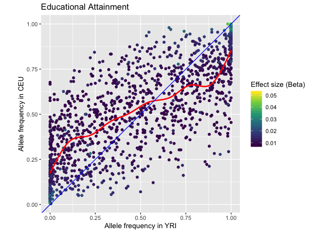
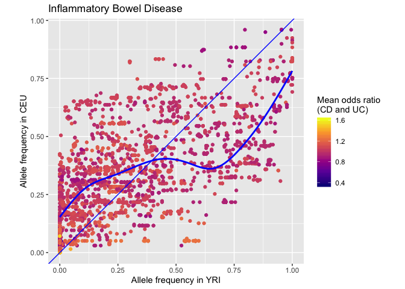
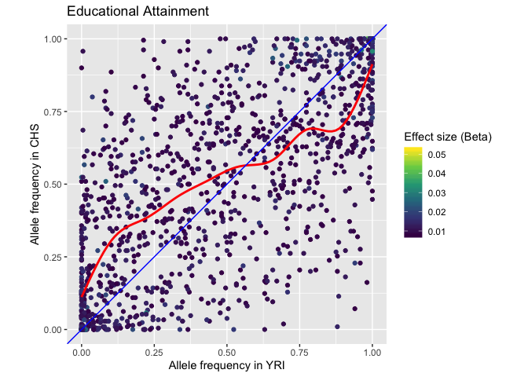
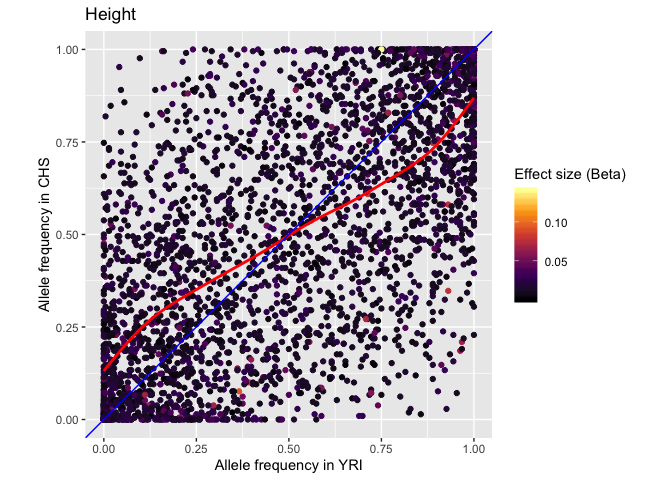
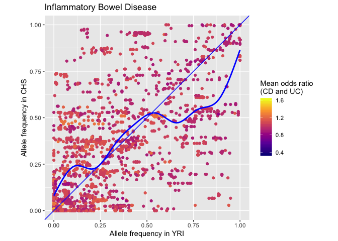
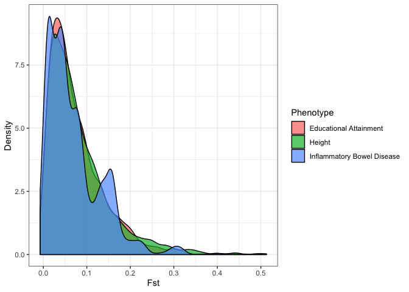

# Setup

• Working directory on EBI Cluster: `/hps/research1/birney/users/ian/rac_hyp`
• GitHub repository: <https://github.com/Ian-Brettell/racist_hypothesis>

## EBI cluster

### Update GATK


```bash
cd /nfs/software/birney
wget https://github.com/broadinstitute/gatk/releases/download/4.1.4.1/gatk-4.1.4.1.zip
unzip gatk-4.1.4.1.zip

# amend aliases in ~/.bashrc and ~/.bash_profile
export PATH=$PATH:/nfs/software/birney/gatk-4.1.4.1/
```

## Download 1GK data

### Download from FTP


```bash
wget -r -p -k --no-parent -cut-dirs=5 ftp://ftp.1000genomes.ebi.ac.uk/vol1/ftp/release/20130502/
```

### Put list of files into list


```bash
find vcfs/ftp.1000genomes.ebi.ac.uk/ALL.chr*.vcf.gz > racist_hypothesis/data/20200205_vcfs.list
```

### Merge VCFs


```bash
java -jar /nfs/software/birney/picard-2.9.0/picard.jar MergeVcfs \
  I=racist_hypothesis/data/20200205_vcfs.list \
  O=vcfs/1gk_all.vcf.gz
# Exception in thread "main" java.lang.IllegalArgumentException: The contig entries in input file /hps/research1/birney/users/ian/rac_hyp/vcfs/ftp.1000genomes.ebi.ac.uk/ALL.chrMT.phase3_callmom-v0_4.20130502.genotypes.vcf.gz are not compatible with the others.

# So remove that one from list above
sed -i '/MT/d' racist_hypothesis/data/20200205_vcfs.list

# run MergeVCFs again
java -jar /nfs/software/birney/picard-2.9.0/picard.jar MergeVcfs \
  I=racist_hypothesis/data/20200205_vcfs.list \
  O=vcfs/1gk_all.vcf.gz
  
# Exception in thread "main" java.lang.IllegalArgumentException: The contig entries in input file /hps/research1/birney/users/ian/rac_hyp/vcfs/ftp.1000genomes.ebi.ac.uk/ALL.chrY.phase3_integrated_v2a.20130502.genotypes.vcf.gz are not compatible with the others.
sed -i '/chrY/d' racist_hypothesis/data/20200205_vcfs.list

# run MergeVCFs again
java -jar /nfs/software/birney/picard-2.9.0/picard.jar MergeVcfs \
  I=racist_hypothesis/data/20200205_vcfs.list \
  O=vcfs/1gk_all.vcf.gz
# SUCCESS
```

## Obtain GWAS data

### Educational attainment

From **Lee et al. (2019)** Gene discovery and polygenic prediction from a genome-wide association study of educational attainment in 1.1 million individuals, *Nature*: <https://www.nature.com/articles/s41588-018-0147-3>.

Data download link: <https://static-content.springer.com/esm/art%3A10.1038%2Fs41588-018-0147-3/MediaObjects/41588_2018_147_MOESM3_ESM.xlsx>

Saved here: `data/20180723_Lee-et-al_supp-tables.xlsx`

### Height

From **Yengo et al. (2018)** Meta-analysis of genome-wide association studies for height and body mass index in approximately 700000 individuals of European ancestry, *Human Molecular Genetics*: <https://academic.oup.com/hmg/article-abstract/27/20/3641/5067845>.

Data downloaded from this webpage:
<https://portals.broadinstitute.org/collaboration/giant/index.php/GIANT_consortium_data_files>
Data download link: <https://portals.broadinstitute.org/collaboration/giant/images/e/e2/Meta-analysis_Locke_et_al%2BUKBiobank_2018_top_941_from_COJO_analysis_UPDATED.txt.gz> 


```bash
cd racist_hypothesis/data
# download
wget https://portals.broadinstitute.org/collaboration/giant/images/e/e2/Meta-analysis_Locke_et_al%2BUKBiobank_2018_top_941_from_COJO_analysis_UPDATED.txt.gz
# unzip
gunzip Meta-analysis_Locke_et_al%2BUKBiobank_2018_top_941_from_COJO_analysis_UPDATED.txt.gz
# rename
mv Meta-analysis_Wood_et_al+UKBiobank_2018_top_3290_from_COJO_analysis.txt 20181015_Yengo-et-al_snps_height.txt
```

Saved here: `data/20181015_Yengo-et-al_snps_height.txt`

### IBD

From **Huang et al. (2017)** Fine-mapping inflammatory bowel disease loci to single-variant resolution, *Nature*: <https://www.nature.com/articles/nature22969#Sec29>.

Data download link (Supplementary Table 1): <https://static-content.springer.com/esm/art%3A10.1038%2Fnature22969/MediaObjects/41586_2017_BFnature22969_MOESM2_ESM.xlsx>

Saved here: `data/20170628_Huang-et-al_supp-table-1.xlsx`

## Filter 1GK VCF for target SNPs

### EA

#### Create list of target SNPs


```r
# extract from excel doc
snps_eduyrs <- read_xlsx(here::here("data", "20180723_Lee-et-al_supp-tables.xlsx"), sheet = "2. EduYears Lead SNPs", skip = 1, n_max = 1271)
# write table of SNPs
write.table(snps_eduyrs[["SNP"]], here::here("data", "20200316_snps_eduyears.list"), quote = F, row.names = F, col.names = F)
```

#### Create filtered VCF


```bash
gatk SelectVariants \
  -R refs/hs37d5.fa.gz \
  -V vcfs/1gk_all.vcf.gz \
  --keep-ids racist_hypothesis/data/20200316_snps_eduyears.list \
  -O vcfs/snphits_eduyrs.vcf.gz
```

### Height

#### Create list of target SNPs


```bash
cut -f1 racist_hypothesis/data/20181015_Yengo-et-al_snps_height.txt | tail -n+2 > racist_hypothesis/data/20200318_snps_height.list
```

#### Extract calls for those SNPs from VCF


```bash
gatk SelectVariants \
  -R refs/hs37d5.fa.gz \
  -V vcfs/1gk_all.vcf.gz \
  --keep-ids racist_hypothesis/data/20200318_snps_height.list \
  -O vcfs/snphits_height.vcf.gz
```

### IBD

#### Create list of target SNPs


```r
# extract from excel doc
snps_ibd <- read_xlsx(path = here::here("data", "20170628_Huang-et-al_supp-table-1.xlsx"),
                      sheet = "list of variants", )
# write tables of SNPs
write.table(x = snps_ibd$variant,
            file = here::here("data", "20200319_snps_ibd.list"),
            quote = F,
            row.names = F,
            col.names = F)
```

#### Extract calls for those SNPs from VCF


```bash
gatk SelectVariants \
  -R refs/hs37d5.fa.gz \
  -V vcfs/1gk_all.vcf.gz \
  --keep-ids racist_hypothesis/data/20200319_snps_ibd.list \
  -O vcfs/snphits_ibd_full.vcf.gz
```

## Copy VCFs for all into data folder


```bash
cp vcfs/snphits* racist_hypothesis/data
```

# Analysis

## Load packages


```r
library(here)
library(pegas)
library(tidyverse)
library(readxl)
library(plotly)
```

## Import 1GK metadata (for sample-population key)

Downloded via this page: <http://www.internationalgenome.org/data>
Download link: <http://ftp.1000genomes.ebi.ac.uk/vol1/ftp/technical/working/20130606_sample_info/20130606_sample_info.xlsx>. 


```r
meta <- read_xlsx(here::here("data", "20130606_sample_info.xlsx"), sheet = "Sample Info") %>% dplyr::select(Sample, Population, Gender)
meta
```

```
## # A tibble: 3,500 x 3
##    Sample  Population Gender
##    <chr>   <chr>      <chr> 
##  1 HG00096 GBR        male  
##  2 HG00097 GBR        female
##  3 HG00098 GBR        male  
##  4 HG00099 GBR        female
##  5 HG00100 GBR        female
##  6 HG00101 GBR        male  
##  7 HG00102 GBR        female
##  8 HG00103 GBR        male  
##  9 HG00104 GBR        female
## 10 HG00105 GBR        male  
## # … with 3,490 more rows
```

## Read in VCFs and obtain allele counts for target SNPs


```r
# list target VCFs
target_vcfs <- list.files(here::here("data"),
                          pattern = glob2rx("snphits_*.gz"), 
                          full.names = T)
# remove the shorter IBD list
target_vcfs <- target_vcfs[1:3]

# read in VCFs and get allele counts
vcf_list <- lapply(target_vcfs, function(vcf_file){
  # read in VCFs
  vcf_out <- pegas::read.vcf(vcf_file)
  # create population column
  populations <- unlist(lapply(rownames(vcf_out), function(sample){
  meta$Population[meta$Sample == sample]
  }))
  vcf_out$population <- populations
  # reorder
  vcf_out <- vcf_out %>% dplyr::select(population, everything())
  # split by population
  vcf_out_split <- split(vcf_out, f = vcf_out$population)
  # remove population columns
  vcf_out_split <- lapply(vcf_out_split, function(x){
    x$population <- NULL
    return(x)
  })
  # get allele counts
  allele_counts <- lapply(vcf_out_split, function(population){
    summary(population)
  })
  return(allele_counts)
})
# set names
names(vcf_list) <- gsub("snphits_|.vcf.gz", "", list.files(here::here("data"), pattern = glob2rx("snphits_*.gz"))[1:3])
```

## Read in SNP data

**NOTE**:

• In the *Lee et al.* (edu_years) data tables, the sheet says: "Notes: Clumping of GWAS results was performed as described in the Supplementary Notes. SNPs are ordered by P-value. Chromosome (CHR) and base pair (BP) positions are reported for human genome build 37 (hg19). *"Allele 1" is the allele whose estimated effect size (Beta) and allele frequency are reported.* Standard errors (SE) and P-values are derived from test statistics that have been adjusted by an estimated LDSC intercept of 1.113. The analysis is based on 10,016,265 SNPs. The average chi-squared statistic is 2.530/2.816 (adjusted and unadjusted, respectively) and lambda GC is 2.038 (unadjusted)."

• In the *Yengo et al.* (height) data tables, the header is self-explanatory.

• In the *Huang et al.* (ibd) data tables, the SNPs have odds ratios rather than betas. Also, the legend says that *A0 is the reference allele and A1 is the tested allele*. p_multi is the -log10(P-value) for multi-variate model.


```r
# create empty list
snps_list <- list()
# add edu_years SNPs
snps_list[["edu_years"]] <- read_xlsx(here::here("data", "20180723_Lee-et-al_supp-tables.xlsx"), sheet = "2. EduYears Lead SNPs", skip = 1, n_max = 1271) %>% 
  dplyr::select(snp = "SNP", 
                tested_allele = "Allele 1", 
                other_allele = "Allele2", 
                effect_size = "Effect size", 
                p_value = "P-value")
# add height SNPs
snps_list[["height"]] <- read_delim(here::here("data", "20181015_Yengo-et-al_snps_height.txt"), delim = "\t") %>% 
  dplyr::select(snp = "SNP", 
                tested_allele = "Tested_Allele", 
                other_allele = "Other_Allele", 
                effect_size = "BETA", 
                p_value = "P")
# add ibd SNPs (full list) - note the "effect size" here is the mean odds ratio across both CD and UC
snps_list[["ibd_full"]] <- read_xlsx(here::here("data", "20170628_Huang-et-al_supp-table-1.xlsx"), sheet = "list of variants") %>% 
  dplyr::mutate(mean_or = (OR_CD + OR_UC) / 2) %>% 
  dplyr::select(snp = "variant", 
                tested_allele = "A1", 
                other_allele = "A0", 
                effect_size =  "mean_or",
                p_value = "P_mean_95")
# add ibd SNPS (short list) - note the "effect size" here is the mean odds ratio across both CD and UC
## Note: this shortened list wasn't used in the analysis
snps_list[["ibd"]] <- read_xlsx(here::here("data", "20170628_Huang-et-al_supp-table-1.xlsx"), sheet = "list of credible sets") %>% 
  dplyr::mutate(mean_or = (OR_CD + OR_UC) / 2) %>% 
  dplyr::select(snp = "variant.lead", 
                tested_allele = "A1", 
                other_allele = "A0", 
                effect_size =  "mean_or",
                p_value = "p_multi")
```

### Filter out indels from full IBD list


```r
# create vector of indels
indel_tested <- which(nchar(snps_list[["ibd_full"]]$tested_allele) > 1)
indel_other <- which(nchar(snps_list[["ibd_full"]]$other_allele) > 1)
ibd_indels <- unique(sort(c(indel_tested, indel_other)))
      
# filter
snps_list[["ibd_full"]] <- dplyr::slice(snps_list[["ibd_full"]], (ibd_indels * -1))
```

## Create data frames with allele frequencies


```r
# Create function to get allele frequencies
get_alfreq_table <- function(population, snp_df){
  # take only the SNPs that are also in the snp_df
  indexes_to_keep <- which(names(population) %in% snp_df$snp == T)
  population <- population[indexes_to_keep]
  # start loop
  counter <- 0
  population <- lapply(population, function(snp_summary){
    # set counter and extract SNP ID
    counter <<- counter + 1
    snp_id <- names(population)[counter]
    # create final DF
    final_df <- data.frame("allele" = names(snp_summary$allele),
                           "count" = snp_summary$allele,
                           stringsAsFactors = F)
    # get allele frequency
    final_df$al_freq <- final_df$count / sum(final_df$count)
    # pull out effect sizes and p-values from snp_df
    effect_sizes <- data.frame("allele" = c(snp_df$other_allele[snp_df$snp == snp_id],
                                            snp_df$tested_allele[snp_df$snp == snp_id]),
                               "effect_size" = c(0, snp_df$effect_size[snp_df$snp == snp_id]),
                               "p_value" = c(0, snp_df$p_value[snp_df$snp == snp_id]),
                               stringsAsFactors = F)
    # join DFs. Note that it only joins the two alleles in the snp_df
    final_df <- dplyr::left_join(effect_sizes, final_df, by = "allele")
    # remove any rows with NA (caused by having a third allele)
    final_df <- final_df[complete.cases(final_df), ]
    # convert negative effects sizes into positive ones by flipping the allele
    if(any(final_df$effect_size < 0)){
      final_df$effect_size[final_df$effect_size == 0] <- final_df$effect_size[final_df$effect_size < 0] * (-1)
      final_df$effect_size[final_df$effect_size < 0] <- 0
    }
    return(final_df)
  })
  return(population)
}

# Run over list
counter_new <- 0
alcnt_df_lst <- lapply(vcf_list, function(pheno){
  counter_new <<- counter_new + 1
  lapply(pheno, function(x){
    out <- get_alfreq_table(population = x, snp_df = snps_list[[counter_new]])
    final <- dplyr::bind_rows(out, .id = "snp")
    return(final)
  })
})

# create final DF
alcnt_df <- lapply(alcnt_df_lst, function(pheno){
  dplyr::bind_rows(pheno, .id = "population")
})
str(alcnt_df)
```

```
## List of 3
##  $ eduyrs  :'data.frame':	66040 obs. of  7 variables:
##   ..$ population : chr [1:66040] "ACB" "ACB" "ACB" "ACB" ...
##   ..$ snp        : chr [1:66040] "rs780569" "rs780569" "rs34394051" "rs34394051" ...
##   ..$ allele     : chr [1:66040] "T" "A" "G" "A" ...
##   ..$ effect_size: num [1:66040] 0.0085 0 0.0117 0 0 0.0151 0 0.0099 0 0.0086 ...
##   ..$ p_value    : num [1:66040] 0.00 4.98e-08 0.00 2.30e-09 0.00 ...
##   ..$ count      : int [1:66040] 87 105 35 157 116 76 183 9 11 181 ...
##   ..$ al_freq    : num [1:66040] 0.453 0.547 0.182 0.818 0.604 ...
##  $ height  :'data.frame':	170300 obs. of  7 variables:
##   ..$ population : chr [1:170300] "ACB" "ACB" "ACB" "ACB" ...
##   ..$ snp        : chr [1:170300] "rs385039" "rs385039" "rs12743493" "rs12743493" ...
##   ..$ allele     : chr [1:170300] "G" "A" "G" "A" ...
##   ..$ effect_size: num [1:170300] 0.0205 0 0 0.0139 0 0.0054 0.0092 0 0.0112 0 ...
##   ..$ p_value    : num [1:170300] 0.0 9.2e-38 0.0 4.9e-19 0.0 ...
##   ..$ count      : int [1:170300] 18 174 118 74 177 15 188 4 81 111 ...
##   ..$ al_freq    : num [1:170300] 0.0938 0.9062 0.6146 0.3854 0.9219 ...
##  $ ibd_full:'data.frame':	197964 obs. of  7 variables:
##   ..$ population : chr [1:197964] "ACB" "ACB" "ACB" "ACB" ...
##   ..$ snp        : chr [1:197964] "rs1886731" "rs1886731" "rs942824" "rs942824" ...
##   ..$ allele     : chr [1:197964] "T" "C" "T" "C" ...
##   ..$ effect_size: num [1:197964] 0 0.962 0 0.962 0 ...
##   ..$ p_value    : num [1:197964] 0 0.0021 0 0.00218 0 ...
##   ..$ count      : int [1:197964] 34 158 29 163 41 151 45 147 28 164 ...
##   ..$ al_freq    : num [1:197964] 0.177 0.823 0.151 0.849 0.214 ...
```

```r
# filter only for alleles with an effect and correct rownames
alcnt_df_filt <- lapply(alcnt_df, function(pheno){
  pheno <- pheno[pheno$effect_size != 0, ]
  rownames(pheno) <- seq(1:nrow(pheno))
  return(pheno)
})  
```

## Create columns for each population


```r
plot_df_lst <- lapply(alcnt_df_filt, function(pheno){
  pheno <- pheno %>% dplyr::select(-count)
  pheno <- tidyr::pivot_wider(data = pheno,
                              names_from = population,
                              names_prefix = "al_freq_",
                              values_from = al_freq)
  return(pheno)
})
```

## Plot

### Set up vectors for phenotype-specific parameters


```r
# Colour palettes
colour_pals <- c("viridis", "inferno", "plasma")
# Line colours
line_cols <- c("red", "red", "blue")
# Titles
titles <- c("Educational Attainment", "Height", "Inflammatory Bowel Disease")
# Legend title for effect size
legend_title <- c("Effect size (Beta)", "Effect size (Beta)", "Mean odds ratio\n(CD and UC)")
```

### YRI v CEU


```r
counter <- 0
lapply(plot_df_lst, function(pheno){
  counter <<- counter + 1
  ggplot(pheno, aes(al_freq_YRI, al_freq_CEU, colour = effect_size)) +
    geom_point() +
    scale_color_viridis_c(option = colour_pals[counter]) +
    coord_fixed() +
    geom_smooth(se = F, colour = line_cols[counter]) +
    geom_abline(intercept = 0, slope = 1, colour = "blue") +
    xlab("Allele frequency in YRI") +
    ylab("Allele frequency in CEU") +
    labs(title = titles[counter],
         colour = legend_title[counter])
})
```

<!-- --><!-- --><!-- -->

### YRI v CHS


```r
counter <- 0
lapply(plot_df_lst, function(pheno){
  counter <<- counter + 1
  ggplot(pheno, aes(al_freq_YRI, al_freq_CHS, colour = effect_size)) +
    geom_point() +
    scale_color_viridis_c(option = colour_pals[counter]) +
    coord_fixed() +
    geom_smooth(se = F, colour = line_cols[counter]) +
    geom_abline(intercept = 0, slope = 1, colour = "blue") +
    xlab("Allele frequency in YRI") +
    ylab("Allele frequency in CHS") +
    labs(title = titles[counter],
         colour = legend_title[counter])
})
```

<!-- --><!-- --><!-- -->

## Fst

### Create data frames


```r
# Create raw list of variants
vcf_list_raw <- lapply(target_vcfs, function(vcf_file){
  vcf_out <- pegas::read.vcf(vcf_file)
})

# Create vector of populations
populations <- unlist(lapply(rownames(vcf_list_raw[[1]]), function(sample){
  meta$Population[meta$Sample == sample]
}))

# Generate Fst stats
fst_out_lst <- lapply(vcf_list_raw, function(pheno){
  as.data.frame(pegas::Fst(pheno, pop = populations))
})

# make rownames into separate column
fst_out_lst <- lapply(fst_out_lst, function(pheno){
  pheno$snp <- rownames(pheno)
  return(pheno)
})
names(fst_out_lst) <- titles

# bind into single DF
fst_out_df <- dplyr::bind_rows(fst_out_lst, .id = "phenotype")
head(fst_out_df)
```

### Plot density


```r
ggplot(fst_out_df, aes(Fst, fill = phenotype)) +
  geom_density(alpha = 0.7) +
  labs(fill = "Phenotype") +
  ylab("Density") +
  theme_bw()
```

<!-- -->
