# Setup

* [Working directory]{color="#4f0943"} on EBI Cluster: `/hps/research1/birney/users/ian/hmn_fst`
* [GitHub repository]{color="#4f0943"}: <https://github.com/brettellebi/human_traits_fst>

## `conda` env on cluster


```bash
# Create env on cluster with mamba
mamba create -y \
  -n fst_env_rhel \
  -c bioconda gatk4
conda activate fst_env_rhel
mamba install bcftools plink2 r-base r-essentials r-tidyverse r-units libgdal r-sf
# Export
conda env export \
  --no-builds \
  -f envs/fst_env_rhel.yml
# Activate
conda activate fst_env_rhel
```

## `renv`


```r
# Export env (to renv.lock file)
renv::init()
# To install packages on new system, or 'activate' the env: 
renv::restore()
```

## Source libraries, functions and plotting parameters


```r
library(here)

source(here::here("code", "scripts", "source.R"))
```

## Download 1GK data

### Download from FTP


```bash
wget \
  -r -p -k \
  --no-parent \
  -cut-dirs=5 \
  ftp://ftp.1000genomes.ebi.ac.uk/vol1/ftp/release/20130502/
```

### Put filenames into list


```bash
find vcfs/ftp.1000genomes.ebi.ac.uk/ALL.chr*.vcf.gz \
  > human_traits_fst/data/20200205_vcfs.list
```

### Merge VCFs


```bash
java -jar /nfs/software/birney/picard-2.9.0/picard.jar MergeVcfs \
  I=human_traits_fst/data/20200205_vcfs.list \
  O=vcfs/1gk_all.vcf.gz
# Exception in thread "main" java.lang.IllegalArgumentException: The contig entries in input file /hps/research1/birney/users/ian/rac_hyp/vcfs/ftp.1000genomes.ebi.ac.uk/ALL.chrMT.phase3_callmom-v0_4.20130502.genotypes.vcf.gz are not compatible with the others.

# So remove that one from list above
sed -i '/MT/d' human_traits_fst/data/20200205_vcfs.list

# run MergeVCFs again
java -jar /nfs/software/birney/picard-2.9.0/picard.jar MergeVcfs \
  I=human_traits_fst/data/20200205_vcfs.list \
  O=vcfs/1gk_all.vcf.gz
  
# Exception in thread "main" java.lang.IllegalArgumentException: The contig entries in input file /hps/research1/birney/users/ian/rac_hyp/vcfs/ftp.1000genomes.ebi.ac.uk/ALL.chrY.phase3_integrated_v2a.20130502.genotypes.vcf.gz are not compatible with the others.
sed -i '/chrY/d' human_traits_fst/data/20200205_vcfs.list

# run MergeVCFs again
java -jar /nfs/software/birney/picard-2.9.0/picard.jar MergeVcfs \
  I=human_traits_fst/data/20200205_vcfs.list \
  O=vcfs/1gk_all.vcf.gz
# SUCCESS
```

## Obtain GWAS data from the GWAS Catalog <https://www.ebi.ac.uk/gwas>

### Pull data for each trait

[**NOTE**]{colour = "red"}: Uncheck `Include child trait data` before downloading.

All documents downloaded via 'Download Catalog data' link, then collated and saved here: `data/20210122_gwas_catalog.xlsx`

#### Height

* height: <https://www.ebi.ac.uk/gwas/efotraits/EFO_0004339>
  - **4912 SNPs** from **51 studies**
  
#### BMI

* bmi: <https://www.ebi.ac.uk/gwas/efotraits/EFO_0004340>
  - **7573 SNPs** from **155 studies**
  
#### Educational attainment

* self reported educational attainment: <https://www.ebi.ac.uk/gwas/efotraits/EFO_0004784>
  - **3989 SNPs** from **24 studies**
  
#### Intelligence

* intelligence: <https://www.ebi.ac.uk/gwas/efotraits/EFO_0004337>
  - **2967 SNPs** from **27 studies**
  
#### IBD

* inflammatory bowel disease: <https://www.ebi.ac.uk/gwas/efotraits/EFO_0003767>
  - **536 SNPs** from **34 studies**

#### Pigmentation

* skin pigmentation: <https://www.ebi.ac.uk/gwas/efotraits/EFO_0003784>
  - **102 SNPs** from **6 studies**

* skin pigmentation measurement: <https://www.ebi.ac.uk/gwas/efotraits/EFO_0007009>
  - **233 SNPs** from **9 studies**

* eye color: <https://www.ebi.ac.uk/gwas/efotraits/EFO_0003949>
  - **77 SNPs** from **13 studies**
  
* eye colour measurement:
<https://www.ebi.ac.uk/gwas/efotraits/EFO_0009764>
  - **202 SNPs** from **9 studies**
  
* hair color: <https://www.ebi.ac.uk/gwas/efotraits/EFO_0003924>
  - **424 SNPs** from **18 studies**
  
* hair colour measurement: <https://www.ebi.ac.uk/gwas/efotraits/EFO_0007822>
  - **541 SNPs** from **6 studies**

### Read into list


```r
file_in = here::here("data", "20210122_gwas_catalog.xlsx")
# Create vector of traits
traits = c("hei", "bmi", "edu", "int", "ibd", "pig")
names(traits) = traits
# Assign sheets to traits
sheets <- seq(1:11)
names(sheets) <- c("hei", "bmi", "edu", "int", "ibd", rep("pig", 6))

# get sheets
sheet_names <- readxl::excel_sheets(file_in)

# Create function to read in data
read_catalog_data <- function(path, target_sheet){
  # Read in data
  out = readxl::read_xlsx(path, sheet = target_sheet) %>% 
    dplyr::select(CHR = CHR_ID, 
                  POS = CHR_POS, 
                  SNP_AL = `STRONGEST SNP-RISK ALLELE`, 
                  P = `P-VALUE`, 
                  OR_OR_BETA = `OR or BETA`, 
                  MAPPED_TRAIT,
                  STUDY = `STUDY ACCESSION`,
                  SAMPLE = `INITIAL SAMPLE SIZE`) %>% 
    # Split SNP and risk allele into separate columns
    dplyr::mutate(TOP_SNP = stringr::str_split(SNP_AL, "-", simplify = T)[, 1],
                  RISK_ALLELE = stringr::str_split(SNP_AL, "-", simplify = T)[, 2]) %>% 
    # Reorder and select
    dplyr::select(CHR, POS, TOP_SNP, RISK_ALLELE, P, OR_OR_BETA, MAPPED_TRAIT, STUDY, SAMPLE)
  # Change variables to specific types
  out$CHR <- as.integer(out$CHR)
  out$POS <- as.numeric(out$POS)
  out$P <- as.numeric(out$P)
  # return DF
  return(out)
}

# Read in data
counter <- 0
data_list = lapply(traits, function(trait){
  # set counter 
  counter <<- counter + 1
  # set target file
  target_file = file_in
  # get target sheet
  target_sheet = sheets[names(sheets) == trait]
  length(target_sheet)
  # read in pigmentation data from multiple sheets and bind into single DF
  if (length(target_sheet) > 1){
    # loop over each sheet
    df <- lapply(target_sheet, function(sheet){
      out <- read_catalog_data(target_file,
                               target_sheet = sheet)
    })
    # set name of each DF to name of sheet (replacing spaces with underscores)
    names(df) = sheet_names[target_sheet] %>% 
      stringr::str_replace_all(" ", "_")
    # bind DFs into single DF
    df <- dplyr::bind_rows(df, .id = "PIG_PHENO")
  } 
  else {
    # read in other data
    df <- read_catalog_data(target_file,
                            target_sheet = target_sheet)
  }
  # Set PHENO column
  df$PHENO <- factor(trait, levels = trait_levels)
  # Recode PHENO
  df$PHENO = dplyr::recode(df$PHENO, !!!recode_vec)
  # Create list
  out = list()
  # Return DF as "raw"
  out[["raw"]] = df
  
  return(out)
})
```

```
## Warning in read_catalog_data(target_file, target_sheet = target_sheet): NAs introduced by coercion
```

```
## Warning in read_fun(path = enc2native(normalizePath(path)), sheet_i = sheet, : Expecting numeric in AB1130 /
## R1130C28: got '1E-423'
```

```
## Warning in read_fun(path = enc2native(normalizePath(path)), sheet_i = sheet, : Expecting numeric in L2384 /
## R2384C12: got '2 x 9'
```

```
## Warning in read_fun(path = enc2native(normalizePath(path)), sheet_i = sheet, : Expecting numeric in M2384 /
## R2384C13: got '190120954 x 70383416'
```

```
## Warning in read_fun(path = enc2native(normalizePath(path)), sheet_i = sheet, : Expecting numeric in L3046 /
## R3046C12: got 'X'
```

```
## Warning in read_fun(path = enc2native(normalizePath(path)), sheet_i = sheet, : Expecting numeric in L3070 /
## R3070C12: got 'X'
```

```
## Warning in read_fun(path = enc2native(normalizePath(path)), sheet_i = sheet, : Expecting numeric in L4419 /
## R4419C12: got 'X'
```

```
## Warning in read_fun(path = enc2native(normalizePath(path)), sheet_i = sheet, : Expecting numeric in L4420 /
## R4420C12: got 'X'
```

```
## Warning in read_fun(path = enc2native(normalizePath(path)), sheet_i = sheet, : Expecting numeric in L4421 /
## R4421C12: got 'X'
```

```
## Warning in read_fun(path = enc2native(normalizePath(path)), sheet_i = sheet, : Expecting numeric in L4422 /
## R4422C12: got 'X'
```

```
## Warning in read_fun(path = enc2native(normalizePath(path)), sheet_i = sheet, : Expecting numeric in L4586 /
## R4586C12: got 'X'
```

```
## Warning in read_fun(path = enc2native(normalizePath(path)), sheet_i = sheet, : Expecting numeric in L6641 /
## R6641C12: got 'X'
```

```
## Warning in read_catalog_data(target_file, target_sheet = target_sheet): NAs introduced by coercion

## Warning in read_catalog_data(target_file, target_sheet = target_sheet): NAs introduced by coercion

## Warning in read_catalog_data(target_file, target_sheet = target_sheet): NAs introduced by coercion
```

```
## Warning in read_catalog_data(target_file, target_sheet = sheet): NAs introduced by coercion

## Warning in read_catalog_data(target_file, target_sheet = sheet): NAs introduced by coercion

## Warning in read_catalog_data(target_file, target_sheet = sheet): NAs introduced by coercion

## Warning in read_catalog_data(target_file, target_sheet = sheet): NAs introduced by coercion

## Warning in read_catalog_data(target_file, target_sheet = sheet): NAs introduced by coercion
```

```r
# How many SNPs in raw data
lapply(data_list, function(x) nrow(x[["raw"]]))
```

```
## $hei
## [1] 4912
## 
## $bmi
## [1] 7573
## 
## $edu
## [1] 3989
## 
## $int
## [1] 2967
## 
## $ibd
## [1] 536
## 
## $pig
## [1] 1579
```

```r
# Clean data
data_list = lapply(data_list, function(pheno){
  df_clean = pheno[["raw"]]
  # Remove rows with p-value of 0 (only 32 of them, associated with suntan)
  df_clean = df_clean[df_clean$P != 0, ]
  # Remove rows with NA in CHR
  df_clean = df_clean[!is.na(df_clean$CHR), ]
  # Remove duplicates
  ## Find SNPs that are duplicated
  dupes = unique(df_clean$TOP_SNP[duplicated(df_clean$TOP_SNP) | duplicated(df_clean$TOP_SNP, fromLast = T)])
  ## Select only 1 SNP from each set of duplicated SNPs
  dupe_filt = lapply(dupes, function(dupe){
    # Take the one with the lowest P-value
    min_p = min(df_clean$P[df_clean$TOP_SNP == dupe])
    out = df_clean[df_clean$TOP_SNP == dupe & df_clean$P == min_p, ]
    # If there are still duplicates due to having equal P, take the one with the largest effect size
    if (nrow(out) > 1 ){
      out = out[which.max(out$OR_OR_BETA), ]
    }
    return(out)
  })
  # Bind list into DF
  dupe_filt = dplyr::bind_rows(dupe_filt)
  # Extract non-duplicated rows
  non_dupe = df_clean[!duplicated(df_clean$TOP_SNP) & !duplicated(df_clean$TOP_SNP, fromLast = T), ]
  # Bind non-duplicated rows with filtered duplicates
  df_clean = rbind(non_dupe, dupe_filt) 
  # Add to list
  pheno[["clean"]] = df_clean
  
  return(pheno)
})

# New SNP count
lapply(data_list, function(x) nrow(x[["clean"]]))
```

```
## $hei
## [1] 4359
## 
## $bmi
## [1] 4184
## 
## $edu
## [1] 3021
## 
## $int
## [1] 2544
## 
## $ibd
## [1] 389
## 
## $pig
## [1] 1048
```


```r
lapply(data_list, function(pheno){
  knitr::kable(head(pheno[["clean"]]))
})
```

$hei


| CHR|       POS|TOP_SNP    |RISK_ALLELE |     P| OR_OR_BETA|MAPPED_TRAIT |STUDY      |SAMPLE                                  |PHENO  |
|---:|---------:|:----------|:-----------|-----:|----------:|:------------|:----------|:---------------------------------------|:------|
|  10|  31008555|rs2797910  |G           | 6e-06|    0.01036|body height  |GCST010059 |up to 6,835 Korean ancestry individuals |Height |
|   3|  68732085|rs1156293  |G           | 1e-06|    0.02157|body height  |GCST010059 |up to 6,835 Korean ancestry individuals |Height |
|  10|  98257696|rs1983864  |G           | 6e-06|         NA|body height  |GCST005908 |253,288 European ancestry individuals   |Height |
|  11| 117103213|rs12269901 |C           | 2e-06|         NA|body height  |GCST005908 |253,288 European ancestry individuals   |Height |
|  11|  18624296|rs11024739 |A           | 9e-06|         NA|body height  |GCST005908 |253,288 European ancestry individuals   |Height |
|  11|   8231306|rs110419   |G           | 3e-07|         NA|body height  |GCST005908 |253,288 European ancestry individuals   |Height |

$bmi


| CHR|       POS|TOP_SNP    |RISK_ALLELE |     P| OR_OR_BETA|MAPPED_TRAIT    |STUDY      |SAMPLE                                                                                                                              |PHENO |
|---:|---------:|:----------|:-----------|-----:|----------:|:---------------|:----------|:-----------------------------------------------------------------------------------------------------------------------------------|:-----|
|   5|  79549808|rs6899277  |G           | 2e-06|       0.70|body mass index |GCST003647 |1,235 Hispanic individuals, 706 Asian ancestry individuals, 1,549 African American individuals, 2,395 European ancestry individuals |BMI   |
|   5| 116877085|rs6866721  |C           | 1e-07|       0.76|body mass index |GCST003647 |1,235 Hispanic individuals, 706 Asian ancestry individuals, 1,549 African American individuals, 2,395 European ancestry individuals |BMI   |
|   6|  84154244|rs2497155  |T           | 4e-06|       1.05|body mass index |GCST003647 |1,235 Hispanic individuals, 706 Asian ancestry individuals, 1,549 African American individuals, 2,395 European ancestry individuals |BMI   |
|  11|  17737040|rs7926805  |C           | 1e-06|       0.80|body mass index |GCST003647 |1,235 Hispanic individuals, 706 Asian ancestry individuals, 1,549 African American individuals, 2,395 European ancestry individuals |BMI   |
|   7| 137720035|rs10234581 |C           | 2e-06|         NA|body mass index |GCST003248 |40 Korean ancestry low BMI individuals, 37 Korean ancestry high BMI individuals                                                     |BMI   |
|  11|  56539377|rs2187511  |G           | 1e-06|         NA|body mass index |GCST003248 |40 Korean ancestry low BMI individuals, 37 Korean ancestry high BMI individuals                                                     |BMI   |

$edu


| CHR|      POS|TOP_SNP    |RISK_ALLELE |  P| OR_OR_BETA|MAPPED_TRAIT                         |STUDY      |SAMPLE                                              |PHENO                  |
|---:|--------:|:----------|:-----------|--:|----------:|:------------------------------------|:----------|:---------------------------------------------------|:----------------------|
|  18| 79815871|rs34945223 |?           |  0|         NA|self reported educational attainment |GCST007037 |approximately 455,000 European ancestry individuals |Educational attainment |
|  19|  4474728|rs76608582 |?           |  0|         NA|self reported educational attainment |GCST007037 |approximately 455,000 European ancestry individuals |Educational attainment |
|  19| 18224905|rs4808766  |?           |  0|         NA|self reported educational attainment |GCST007037 |approximately 455,000 European ancestry individuals |Educational attainment |
|  19| 30256794|rs55800473 |?           |  0|         NA|self reported educational attainment |GCST007037 |approximately 455,000 European ancestry individuals |Educational attainment |
|  19| 35761593|rs807478   |?           |  0|         NA|self reported educational attainment |GCST007037 |approximately 455,000 European ancestry individuals |Educational attainment |
|  20| 38884055|rs208795   |?           |  0|         NA|self reported educational attainment |GCST007037 |approximately 455,000 European ancestry individuals |Educational attainment |

$int


| CHR|       POS|TOP_SNP     |RISK_ALLELE |  P| OR_OR_BETA|MAPPED_TRAIT |STUDY      |SAMPLE                                                    |PHENO        |
|---:|---------:|:-----------|:-----------|--:|----------:|:------------|:----------|:---------------------------------------------------------|:------------|
|   2| 156027428|rs72904190  |A           |  0|  0.0284595|intelligence |GCST005316 |120,934 British ancestry individuals, 127,548 individuals |Intelligence |
|   2| 156055088|rs72906064  |T           |  0|  0.0284257|intelligence |GCST005316 |120,934 British ancestry individuals, 127,548 individuals |Intelligence |
|   2| 156667523|rs13023735  |A           |  0|  0.0180964|intelligence |GCST005316 |120,934 British ancestry individuals, 127,548 individuals |Intelligence |
|   2| 160506319|rs62175972  |T           |  0|  0.0467504|intelligence |GCST005316 |120,934 British ancestry individuals, 127,548 individuals |Intelligence |
|   2| 161045556|rs10930011  |A           |  0|  0.0168607|intelligence |GCST005316 |120,934 British ancestry individuals, 127,548 individuals |Intelligence |
|   2| 160955841|rs114952970 |T           |  0|  0.0512996|intelligence |GCST005316 |120,934 British ancestry individuals, 127,548 individuals |Intelligence |

$ibd


| CHR|       POS|TOP_SNP    |RISK_ALLELE |     P| OR_OR_BETA|MAPPED_TRAIT               |STUDY      |SAMPLE                                                      |PHENO |
|---:|---------:|:----------|:-----------|-----:|----------:|:--------------------------|:----------|:-----------------------------------------------------------|:-----|
|   1| 154962487|rs3766920  |A           | 0e+00|       1.35|inflammatory bowel disease |GCST003602 |1,505 Korean ancestry cases, 4,041 Korean ancestry controls |IBD   |
|  16|  80751551|rs16953946 |C           | 0e+00|       1.23|inflammatory bowel disease |GCST003602 |1,505 Korean ancestry cases, 4,041 Korean ancestry controls |IBD   |
|  22|  36912743|rs4821558  |C           | 8e-07|       1.16|inflammatory bowel disease |GCST003602 |1,505 Korean ancestry cases, 4,041 Korean ancestry controls |IBD   |
|   9|  76302462|rs11788518 |T           | 7e-06|       1.39|inflammatory bowel disease |GCST003602 |1,505 Korean ancestry cases, 4,041 Korean ancestry controls |IBD   |
|   9|  21966222|rs3731257  |G           | 0e+00|       1.17|inflammatory bowel disease |GCST003602 |1,505 Korean ancestry cases, 4,041 Korean ancestry controls |IBD   |
|   6| 116919430|rs1321366  |A           | 5e-06|       1.15|inflammatory bowel disease |GCST003602 |1,505 Korean ancestry cases, 4,041 Korean ancestry controls |IBD   |

$pig


|PIG_PHENO         | CHR|       POS|TOP_SNP     |RISK_ALLELE |     P| OR_OR_BETA|MAPPED_TRAIT      |STUDY      |SAMPLE                       |PHENO        |
|:-----------------|---:|---------:|:-----------|:-----------|-----:|----------:|:-----------------|:----------|:----------------------------|:------------|
|skin_pigmentation |   3| 187681148|rs79592764  |T           | 4e-07|       5.23|skin pigmentation |GCST004219 |285 Puerto Rican individuals |Pigmentation |
|skin_pigmentation |  10|  13564490|rs6602666   |G           | 0e+00|       4.03|skin pigmentation |GCST004219 |285 Puerto Rican individuals |Pigmentation |
|skin_pigmentation |  15|  50016753|rs8033655   |G           | 2e-07|       2.29|skin pigmentation |GCST004219 |285 Puerto Rican individuals |Pigmentation |
|skin_pigmentation |  20|  34116821|rs6142102   |G           | 2e-07|       2.21|skin pigmentation |GCST004219 |285 Puerto Rican individuals |Pigmentation |
|skin_pigmentation |   1| 188031112|rs77443641  |A           | 3e-06|      10.94|skin pigmentation |GCST004219 |285 Puerto Rican individuals |Pigmentation |
|skin_pigmentation |   1| 196973530|rs115105970 |T           | 2e-06|       6.84|skin pigmentation |GCST004219 |285 Puerto Rican individuals |Pigmentation |

Get unique mapped traits


```r
lapply(data_list, function(pheno){
  unique(pheno$clean$MAPPED_TRAIT)
})
```

```
## $hei
## [1] "body height"                                                     
## [2] "diastolic blood pressure, body height"                           
## [3] "body weights and measures, body height"                          
## [4] "anthropometric measurement, body height"                         
## [5] "pericardial adipose tissue measurement, body weight, body height"
## 
## $bmi
##  [1] "body mass index"                                                                                                                                                                                                                                                                                                                                        
##  [2] "systolic blood pressure, body mass index"                                                                                                                                                                                                                                                                                                               
##  [3] "body mass index, obesity"                                                                                                                                                                                                                                                                                                                               
##  [4] "response to drug, body mass index"                                                                                                                                                                                                                                                                                                                      
##  [5] "body mass index, body weights and measures"                                                                                                                                                                                                                                                                                                             
##  [6] "body mass index, fasting blood insulin measurement"                                                                                                                                                                                                                                                                                                     
##  [7] "alcohol consumption measurement, body mass index"                                                                                                                                                                                                                                                                                                       
##  [8] "physical activity measurement, body mass index"                                                                                                                                                                                                                                                                                                         
##  [9] "smoking behaviour measurement, body mass index"                                                                                                                                                                                                                                                                                                         
## [10] "waist-hip ratio, body mass index"                                                                                                                                                                                                                                                                                                                       
## [11] "adult onset asthma, body mass index"                                                                                                                                                                                                                                                                                                                    
## [12] "multiple sclerosis, body mass index"                                                                                                                                                                                                                                                                                                                    
## [13] "anthropometric measurement, body mass index"                                                                                                                                                                                                                                                                                                            
## [14] "visceral adipose tissue measurement, body mass index"                                                                                                                                                                                                                                                                                                   
## [15] "body mass index, premature birth, parental genotype effect measurement"                                                                                                                                                                                                                                                                                 
## [16] "bipolar disorder, body mass index"                                                                                                                                                                                                                                                                                                                      
## [17] "total cholesterol measurement, diastolic blood pressure, triglyceride measurement, systolic blood pressure, hematocrit, ventricular rate measurement, glucose measurement, body mass index, high density lipoprotein cholesterol measurement"                                                                                                           
## [18] "Barrett's esophagus, body mass index"                                                                                                                                                                                                                                                                                                                   
## [19] "body mass index, asthma"                                                                                                                                                                                                                                                                                                                                
## [20] "insulin sensitivity measurement, body mass index"                                                                                                                                                                                                                                                                                                       
## [21] "body mass index, visceral:subcutaneous adipose tissue ratio"                                                                                                                                                                                                                                                                                            
## [22] "total cholesterol measurement, hematocrit, stroke, ventricular rate measurement, body mass index, atrial fibrillation, high density lipoprotein cholesterol measurement, coronary artery disease, cancer, diastolic blood pressure, triglyceride measurement, systolic blood pressure, heart failure, diabetes mellitus, glucose measurement, mortality"
## [23] "fibrinogen measurement, body mass index"                                                                                                                                                                                                                                                                                                                
## [24] "urate measurement, body mass index"                                                                                                                                                                                                                                                                                                                     
## [25] "body mass index, fasting blood glucose measurement"                                                                                                                                                                                                                                                                                                     
## [26] "body mass index, age at assessment"                                                                                                                                                                                                                                                                                                                     
## [27] "smoking behavior, body mass index"                                                                                                                                                                                                                                                                                                                      
## [28] "diet measurement, body mass index"                                                                                                                                                                                                                                                                                                                      
## [29] "sex interaction measurement, body mass index, age at assessment"                                                                                                                                                                                                                                                                                        
## [30] "physical activity, body mass index"                                                                                                                                                                                                                                                                                                                     
## 
## $edu
## [1] "self reported educational attainment"                              
## [2] "intelligence, self reported educational attainment"                
## [3] "autism spectrum disorder, self reported educational attainment"    
## [4] "schizophrenia, intelligence, self reported educational attainment" 
## [5] "self reported educational attainment, refractive error measurement"
## [6] "systolic blood pressure, self reported educational attainment"     
## [7] "diastolic blood pressure, self reported educational attainment"    
## [8] "mean arterial pressure, self reported educational attainment"      
## [9] "pulse pressure measurement, self reported educational attainment"  
## 
## $int
## [1] "intelligence"                                                     
## [2] "cesarean section, intelligence"                                   
## [3] "intelligence, specific language impairment, dyslexia"             
## [4] "intelligence, self reported educational attainment"               
## [5] "schizophrenia, intelligence"                                      
## [6] "schizophrenia, intelligence, self reported educational attainment"
## 
## $ibd
##  [1] "inflammatory bowel disease"                                                                           
##  [2] "inflammatory bowel disease, spine bone mineral density"                                               
##  [3] "leukopenia, response to thiopurine, inflammatory bowel disease"                                       
##  [4] "inflammatory bowel disease, femoral neck bone mineral density"                                        
##  [5] "pyoderma gangrenosum, inflammatory bowel disease"                                                     
##  [6] "Erythema nodosum, inflammatory bowel disease"                                                         
##  [7] "myelosuppression, response to thiopurine, inflammatory bowel disease"                                 
##  [8] "Alopecia, response to thiopurine, inflammatory bowel disease"                                         
##  [9] "pancreatitis, response to thiopurine, inflammatory bowel disease"                                     
## [10] "response to thiopurine, thiopurine immunosuppressant-induced pancreatitis, inflammatory bowel disease"
## [11] "digestive system disease, response to thiopurine, inflammatory bowel disease"                         
## 
## $pig
## [1] "skin pigmentation"                                   
## [2] "freckles, skin pigmentation"                         
## [3] "skin pigmentation measurement"                       
## [4] "eye color"                                           
## [5] "eye colour measurement"                              
## [6] "hair color"                                          
## [7] "cutaneous melanoma, hair color"                      
## [8] "hair colour measurement"                             
## [9] "hair colour measurement, hair morphology measurement"
```

Are any of the OR_OR_BETAs negative? 


```r
any(unlist(lapply(data_list, function(pheno) {
  any(pheno$clean$OR_OR_BETA < 0,na.rm = T)
})))
```

```
## [1] FALSE
```

This must means that the `RISK_ALLELE` always affects the trait positively. 

But for what proportion of SNPs is the `RISK_ALLELE` not stated?


```r
lapply(data_list, function(pheno) {
  length(which(pheno$clean$RISK_ALLELE == "?")) / nrow(pheno$clean)
})
```

```
## $hei
## [1] 0.7065841
## 
## $bmi
## [1] 0.5023901
## 
## $edu
## [1] 0.1741145
## 
## $int
## [1] 0.4382862
## 
## $ibd
## [1] 0.3213368
## 
## $pig
## [1] 0.5314885
```

[**NOTE**]{color="red"}: In cases where `RISK_ALLELE` isn't provided, treat the `ALT` allele as `RISK_ALLELE`.

### Generate Manhattan plots

Plot


```r
counter = 0
lapply(data_list, function(pheno_df){
  # set counter
  counter <<- counter + 1
  df = pheno_df[["clean"]]
  trait = unique(df$PHENO)
  # Get title
  title <- paste(trait, "\n", "SNP count:", nrow(df))
  # Plot
  get_man(df, trait = trait, title = title, chr = "CHR", bp = "POS", snp = "TOP_SNP", p = "P")
})
```

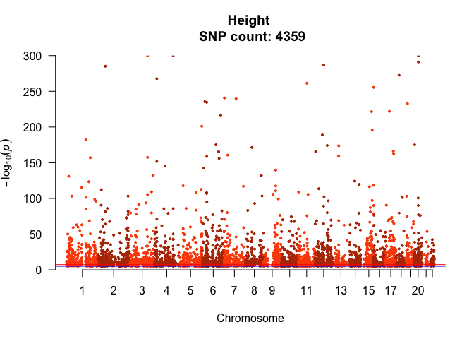<!-- --><!-- --><!-- --><!-- --><!-- --><!-- -->

Save


```r
output_dir = here::here("plots", "20210122_manhattan_all_snps")

counter = 0
lapply(data_list, function(pheno_df){

  # set counter
  counter <<- counter + 1
  df = pheno_df[["clean"]]
  trait = unique(df$PHENO)
  # Get title
  title <- paste(trait, "\n", "SNP count:", nrow(df))
  # Set file name to save
  file = file.path(output_dir,
                   paste("manhattan_",
                         names(data_list)[counter],
                         ".svg",
                         sep = ""))
  # Set up graphics device
  svg(file,
      width = 10,
      height = 6)  
  
  # Plot
  get_man(df, trait = trait, chr = "CHR", bp = "POS", snp = "TOP_SNP", p = "P")
  
  dev.off()
})
```

#### Create list of target SNPs to extract from 1KG


```r
dest_dir = here::here("data", "20210122_snp_hit_lists")

# Make directory
dir.create(dest_dir)
  
# Just SNPs for extracting from 1KG
counter <- 0
lapply(data_list, function(pheno){
  df = pheno[["clean"]]
  # Set counter
  counter <<- counter + 1
  # Set file basename
  trait = names(data_list)[counter]
  filename = paste(trait, ".list", sep = "")
  # Write SNPs to file
  readr::write_lines(df$TOP_SNP, file.path(dest_dir, filename))
})

# SNPs and P-values with header for clumping with Plink
counter <- 0
lapply(data_list, function(pheno){
  df = pheno[["clean"]]
  # Set counter
  counter <<- counter + 1
  # Set file basename
  trait = names(data_list)[counter]
  filename = paste(trait, "_with_P.txt", sep = "")
  # Write SNPs to file
  df %>% 
    dplyr::select(SNP = TOP_SNP, P) %>% 
    readr::write_tsv(file.path(dest_dir, filename))
})
```

## Filter 1KG VCF for target SNPs


```bash

traits=$(echo hei bmi edu int ibd pig)
ref=../refs/hs37d5.fa.gz
in_vcf=../vcfs/1gk_all.vcf.gz
snps_dir=data/20210122_snp_hit_lists
out_dir=data/20210125_snp_hits_filtered

mkdir -p $out_dir

for trait in $(echo $traits ); do
  bsub \
    -M 10000 \
    -o ../log/20210122_extract_snps_$trait.out \
    -e ../log/20210122_extract_snps_$trait.err \
    """
    conda activate fst_env_rhel ;
    gatk SelectVariants \
      -R $ref \
      -V $in_vcf \
      --keep-ids $snps_dir/$trait.list \
      -O $out_dir/$trait.vcf.gz 
    """ ;
done
```

## Get allele frequencies of SNP hits with `Plink2`

### Import 1GK metadata (for sample-population key)

Downloded via this page: <http://www.internationalgenome.org/data>
Download link: <http://ftp.1000genomes.ebi.ac.uk/vol1/ftp/technical/working/20130606_sample_info/20130606_sample_info.xlsx>. 

Saved here: `data/20130606_sample_info.xlsx`


```r
samples_file = here::here("data", "20130606_sample_info.xlsx")

meta = readxl::read_xlsx(samples_file,
                         sheet = "Sample Info") %>%
  dplyr::select(Sample, Population, Gender)

knitr::kable(head(meta))
```


|Sample  |Population |Gender |
|:-------|:----------|:------|
|HG00096 |GBR        |male   |
|HG00097 |GBR        |female |
|HG00098 |GBR        |male   |
|HG00099 |GBR        |female |
|HG00100 |GBR        |female |
|HG00101 |GBR        |male   |

### Write population file for Plink2


```r
sample_popn_key_file = here::here("data", "plink2_sample_popn_key.txt")

write.table(meta[, 1:2],
            sample_popn_key_file,
            quote = F,
            sep = "\t",
            row.names = F,
            col.names = F)
```

### Run `Plink2` for SNP hits

(Take only biallelic SNPs.)


```bash

conda activate fst_env_rhel

# Set variables

traits=$(echo hei bmi edu int ibd pig)
in_vcf_dir=data/20210125_snp_hits_filtered
popn_file=data/plink2_sample_popn_key.txt
out_dir=data/20210122_snp_hits_alfreqs

# Set up directories
mkdir -p $out_dir

for trait in $(echo $traits); do
  mkdir -p $out_dir/$trait; 
done   

# Run Plink2

## Get global AF
for trait in $(echo $traits); do
  plink2 \
    --vcf $in_vcf_dir/$trait.vcf.gz \
    --freq \
    --max-alleles 2 \
    --snps-only \
    --out $out_dir/$trait/$trait.all
done

## Get AF per population
for trait in $(echo $traits); do
  plink2 \
    --vcf $in_vcf_dir/$trait.vcf.gz \
    --freq \
    --max-alleles 2 \
    --snps-only \
    --pheno iid-only $popn_file \
    --loop-cats PHENO1 \
    --out $out_dir/$trait/$trait ;
done
```

### Add allele frequency files


```r
target_dir = here::here("data", "20210122_snp_hits_alfreqs")

# Global
counter <- 0
data_list = lapply(data_list, function(pheno){
  # set counter 
  counter <<- counter + 1
  # get trait name
  trait = names(data_list)[counter]
  # get file path
  target_path = file.path(target_dir, trait, paste(trait, ".all.afreq", sep = ""))
  # read in data
  clean_af = read_afreq(target_path)
  # add POPN column
  clean_af$POPN = "all"
  # add to list
  pheno[["clean_af"]] = clean_af
  
  return(pheno)
})

# Per population
counter <- 0
data_list = lapply(data_list, function(pheno){
  # set counter
  counter <<- counter + 1
  # get trait name
  trait = names(data_list)[counter]
  # get file path
  target_files = list.files(file.path(target_dir, trait),
                            pattern = ".*[^all]\\.afreq",
                            full.names = T)
  # get popn names
  names(target_files) = basename(target_files) %>% 
    str_split("\\.", simplify = T) %>% 
    subset(select = 2)
  # read files and bind into single DF
  popn_afreqs = lapply(target_files, function(popn){
    df = read_afreq(popn)
  }) %>% 
    dplyr::bind_rows(.id = "POPN")# %>% 
#    dplyr::select(-OBS_CT) %>% 
#    tidyr::pivot_wider(id_cols = SNP, names_from = POPN, values_from = ALT_FREQS)
  # combine with `clean_af`
  pheno[["clean_af"]] = dplyr::bind_rows(pheno[["clean_af"]],
                                         popn_afreqs)
  
  return(pheno)
})
```

## Set up negative controls

Pull out random SNPs with the same global allele frequencies as the GWAS SNP-hits

### Bin SNP hits by allele frequency

Bind to clean DF to get AFs of risk allele

[**NOTE**]{color="red"}: If `RISK_ALLELE` is unknown, set the allele frequency to `ALT_FREQS`


```r
data_list = lapply(data_list, function(pheno){
  # join DFs
  df = dplyr::left_join(pheno[["clean"]],
                        dplyr::select(pheno[["clean_af"]],
                                      -CHR),
                        by = c("TOP_SNP" = "SNP"))
  # get AF of risk allele
  df$RISK_AF = dplyr::if_else(df$RISK_ALLELE == "?",
                              df$ALT_FREQS,
                              dplyr::if_else(df$RISK_ALLELE == df$ALT,
                                             df$ALT_FREQS,
                                             1 - df$ALT_FREQS))
  # add `HIT_CONTROL` column
  df$HIT_CONTROL = "hit"
  # add to list
  pheno[["consol"]] = df
  
  return(pheno)
})
```


Bin by risk allele frequency


```r
# 1% intervals
breakpoints = seq(0, 1, 0.01)

data_list = lapply(data_list, function(pheno){
  # choose DF
  df = pheno[["consol"]]
  # add bins
  df$BIN_100 = cut(df$RISK_AF, breaks = breakpoints, labels = F)
  # save back into list
  pheno[["consol"]] = df
  
  return(pheno)
})
```

Extract key columns and write to file


```r
out_dir = here::here("data", "20210126_snp_risk_hits_binned")

dir.create(out_dir)

# Save list
counter <- 0
risk_afs = lapply(data_list, function(pheno){
  # set counter 
  counter <<- counter + 1
  # get target DF
  df = pheno[["consol"]]
  # filter
  df = df %>% 
    dplyr::filter(POPN == "all") %>% # take only global AFs 
    dplyr::select(TOP_SNP, BIN_100) %>% 
    tidyr::drop_na() # drop NAs
  # set output path
  trait = names(data_list)[counter]
  path_out = file.path(out_dir, paste(trait, ".txt", sep = ""))
  # write to file
  readr::write_tsv(df, path_out)
})
```

### Bin 1KG SNPs 

#### Get allele frequencies from 1KG

With `Plink2`, per chromosome for speed.


```bash
# set output directory
in_file=../vcfs/1gk_all.vcf.gz
out_dir=../big_data/20210125_alfreqs_all

mkdir -p $out_dir

# Per chromosome
for chr in $(seq 1 22) ; do
  # create allele-freq tables
  bsub \
    -M 10000 \
    -o ../log/20210125_plink_alfreq_$chr.out \
    -e ../log/20210125_plink_alfreq_$chr.err \
    """
    conda activate fst_env_rhel ;
    plink2 \
      --vcf $in_file \
      --freq \
      --chr $chr \
      --max-alleles 2 \
      --snps-only \
      --out $out_dir/$chr ";
done 
```

#### Bin them and save to single file


```r
# On cluster

library(here)
source(here::here("code", "scripts", "source.R"))

# Set variables
in_dir = "../big_data/20210125_alfreqs_all"
out_dir = "../big_data/20210125_alfreqs_all_binned"
breakpoints = seq(0, 1, 0.01) # 1% bins

# Create output directory
dir.create(out_dir)

# Get list of input files
in_files = list.files(in_dir, pattern = ".afreq", full.names = T)

# Read in files, add bins, and write to output
freq_list = lapply(in_files, function(chr_file){
  # read in file
  df = read_afreq(chr_file)
  # add bins
  df$BIN_100 = cut(df$ALT_FREQS, breaks = breakpoints, labels = F)
  # write file
  readr::write_tsv(df, file = file.path(out_dir, basename(chr_file)))
})

# Combine into single DF
freq_df = dplyr::bind_rows(freq_list)

# Write to file
readr::write_tsv(freq_df, file = file.path(out_dir, "all.afreq"))
```

#### Pull out random SNPs with same AF as trait risk alleles


```r
# On cluster

library(here)
source(here::here("code", "scripts", "source.R"))

# Variables

input_risk_snp_dir = here::here("data", "20210126_snp_risk_hits_binned")
all_1kg_bins = "../big_data/20210125_alfreqs_all_binned/all.afreq"
initial_seed = 123
output_dir = here::here("data", "20210126_random_snps")
output_dir_snpids = here::here("data", "20210126_random_snps_snp_ids")

dir.create(output_dir)
dir.create(output_dir_snpids)

## Read in target SNP DF and split into list by bin
phenos = gsub(".txt", "", basename(list.files(input_risk_snp_dir)))
names(phenos) = phenos

risk_list = lapply(phenos, function(pheno){
  # set file path
  file_path = file.path(input_risk_snp_dir, paste(pheno, ".txt", sep = ""))
  # read file
  out = readr::read_tsv(file_path,
                        col_names = T) %>% 
    split(., f = .$BIN_100) # split by bin
})
  
## Read in 1KG data
freq_df = readr::read_tsv(all_1kg_bins)

# For each bin in `risk_list`, pull out the same number of random number 1KG SNPs with the same bin

## Set seed
set.seed(initial_seed)

## Get seeds for each bin
seeds = sample(1:1000, length(risk_list))

## Run over list
counter <- 0
lapply(risk_list, function(pheno){
  # set counter 
  counter <<- counter + 1  
  # set seed for pheno
  set.seed(seeds)[counter]
  # get seeds for bin
  bin_seeds = sample(1:1000, length(pheno))
  # get random SNPs from each bin
  bin_counter <- 0
  out = lapply(pheno, function(bin_df){
    # set `bin_counter`
    bin_counter <<- bin_counter + 1
    # get target bin
    target_bin = as.integer(names(pheno)[bin_counter])
    # get number of matches required
    hits_n = nrow(bin_df)
    # set seed
    set.seed(bin_seeds[bin_counter])    
    # filter 1kg DF for SNPs with same bin and get random hits
    random_hits = freq_df %>% 
      #dplyr::select(SNP, ALT_FREQS, OBS_CT, BIN_100) %>% 
      dplyr::filter(BIN_100 == target_bin) %>% 
      dplyr::slice_sample(n = hits_n) %>% 
      dplyr::rename(RANDOM_SNP = SNP,
                    RANDOM_BIN_100 = BIN_100)
    # bind `random_hits` to target SNP df
    df_out = cbind(bin_df, random_hits)
    
    return(df_out)
  }) %>% 
    # bind into single data frame
    dplyr::bind_rows()
  
  # save to file
  ## set output path
  trait = names(risk_list)[counter]
  out_path = file.path(output_dir, paste(trait, ".txt", sep = ""))
  ## write file
  readr::write_tsv(out, out_path)
  
  # save just SNP IDs (for Plink to get per-population AFs)
  out_path = file.path(output_dir_snpids, paste(trait, ".list", sep = ""))
  ## write file
  readr::write_lines(out$RANDOM_SNP, out_path)  
})
```

#### Filter VCFs for random SNPs


```bash
traits=$(echo hei bmi edu int ibd pig)
ref=../refs/hs37d5.fa.gz
in_vcf=../vcfs/1gk_all.vcf.gz
snps_dir=data/20210126_random_snps_snp_ids
out_dir=data/20210127_snp_rndm_filtered

mkdir -p $out_dir

for trait in $(echo $traits ); do
  bsub \
    -M 10000 \
    -o ../log/20210127_extract_snps_$trait.out \
    -e ../log/20210127_extract_snps_$trait.err \
    """
    conda activate fst_env_rhel ;
    gatk SelectVariants \
      -R $ref \
      -V $in_vcf \
      --keep-ids $snps_dir/$trait.list \
      -O $out_dir/$trait.vcf.gz 
    """ ;
done
```

#### Get per-population allele frequencies of random SNPs 


```bash
traits=$(echo hei bmi edu int ibd pig)
random_snps_dir=data/20210126_random_snps_snp_ids
vcf_in_dir=data/20210127_snp_rndm_filtered
popn_key=data/plink2_sample_popn_key.txt
out_dir=data/20210127_snp_rndm_alfreqs


for trait in $(echo $traits ); do

  mkdir -p $out_dir/$trait
  
  bsub \
    -M 10000 \
    -o ../log/20210127_rdm_popn_afreqs_$trait.out \
    -e ../log/20210127_rdm_popn_afreqs_$trait.err \
    """
    conda activate fst_env_rhel ;
    plink2 \
      --vcf $vcf_in_dir/$trait.vcf.gz \
      --extract $random_snps_dir/$trait.list \
      --freq \
      --pheno iid-only $popn_key \
      --loop-cats PHENO1 \
      --out $out_dir/$trait/$trait
    """ ;
done  
```

#### Bind into single DF


```r
in_dir_rndm = here::here("data", "20210126_random_snps")
in_dir_afreq = here::here("data", "20210127_snp_rndm_alfreqs")

# Read in data

## Random SNPs
in_files_rndm = list.files(in_dir_rndm, full.names = T)
names(in_files_rndm) = gsub(".txt", "", basename(in_files_rndm))

random_snps = lapply(in_files_rndm, function(file){
  out = readr::read_tsv(file)
  # add `POPN` column
  out$POPN = "all"
  
  return(out)
}) %>% 
  dplyr::bind_rows(.id = "PHENO")

## Popn afreqs
popn_afreqs = lapply(trait_levels, function(pheno){
  target_files = list.files(file.path(in_dir_afreq, pheno), pattern = ".afreq", full.names = T)
  
  names(target_files) = basename(target_files) %>% 
    str_split("\\.", simplify = T) %>% 
    subset(select = 2)
  
  popn_afreqs = lapply(target_files, function(popn){
    df = read_afreq(popn)
  }) %>% 
    dplyr::bind_rows(.id = "POPN") # %>% 
  #  dplyr::select(-OBS_CT) %>% 
  #  tidyr::pivot_wider(id_cols = SNP, names_from = POPN, values_from = c(ALT_FREQS, OBS_CT))
  
  return(popn_afreqs)
}) %>% 
  dplyr::bind_rows(.id = "PHENO")

# Bind `popn_afreqs` to `random_snps`
random_afreqs = dplyr::full_join(dplyr::select(random_snps, -c(POPN, ALT_FREQS, OBS_CT)),
                                 popn_afreqs,
                                 by = c("PHENO", "RANDOM_SNP" = "SNP", "REF", "ALT", "CHR"))
# Bind `all` AFs
random_afreqs = rbind(random_afreqs, random_snps)

## Recode PHENO
#random_afreqs$PHENO = dplyr::recode(random_afreqs$PHENO, !!!rev_recode_vec)

## Add `HIT_CONTROL` column
random_afreqs$HIT_CONTROL = "control"
```

#### Add to `data_list`


```r
counter <- 0
data_list = lapply(data_list, function(pheno){
  # set counter
  counter <<- counter + 1
  # set target pheno
  target_pheno = names(data_list)[counter]
  # add random afreqs
  random_af = random_afreqs %>% 
    dplyr::filter(PHENO == target_pheno)
  # recode PHENO
  random_af$PHENO = dplyr::recode(random_af$PHENO, !!!recode_vec)
  # add to list
  pheno[["random_af"]] = random_af
  
  return(pheno)
})
```

## Clump to get lead SNPs

Use `Plink1.9` (`Plink2.0` doesn't have a `clump` function.)

From the `Plink1.7` documentation (<http://zzz.bwh.harvard.edu/plink/clump.shtml>), which applies to `Plink1.9`:

> The clumping procedure takes all SNPs that are significant at threshold p1 that have not already been clumped (denoting these as index SNPs) and forms clumps of all other SNPs that are within a certain kb distance from the index SNP (default 250kb) and that are in linkage disequilibrium with the index SNP, based on an r-squared threshold (default 0.50)... This is a greedy algorithm and so each SNP will only appear in a single clump, if at all. 

> ...[t]he TOTAL field lists all SNPs that are clumped with the index SNP, irrespective of the p-value for those SNPs. This number is then split into those clumped SNPs that are not significant (p>0.05) and various other groups defined by significance thresholds. For SNPs that are significant at the p2 threshold, they are listed explicitly. The (1) after each SNP name refers to the results file they came from (in this case, there is only a single result file specified, so all values are 1).

Here, we're taking all SNPs with *P* < 1e-08 as index SNPs, and it will explicitly list all SNPs within the clump that also meet that threshold. 


```bash

# Activate environment
conda activate fst_env_rhel

# Set variables
traits=$(echo hei bmi edu int ibd pig)
in_vcf_dir=data/20210125_snp_hits_filtered
snp_p_dir=data/20210122_snp_hit_lists
out_dir=data/20210125_clumped

r2_params=$(echo 0.1 0.2 0.3)
kb_params=$(echo 500 750 1000 )

# Make directory
mkdir -p $out_dir

# Run with different parameters
for trait in $(echo $traits ); do

  mkdir -p $out_dir/$trait ;
  
  for r2 in $r2_params ; do
    for kb in $kb_params ; do
      bsub \
        -o ../log/20210125_clump_$trait\_$r2\_$kb.out \
        -e ../log/20210125_clump_$trait\_$r2\_$kb.err \
        """
        conda activate fst_env_rhel ;
        plink \
          --vcf $in_vcf_dir/$trait.vcf.gz \
          --clump $snp_p_dir/$trait\_with_P.txt \
          --clump-p1 0.00000001 \
          --clump-p2 0.00000001 \
          --clump-r2 $r2 \
          --clump-kb $kb \
          --out $out_dir/$trait/r2-$r2\_kb-$kb 
        """  ;
    done ;
  done;  
done

```

### Add clumped SNP files to `data_list`


```r
target_dir = here::here("data", "20210125_clumped")

counter <- 0
data_list = lapply(data_list, function(pheno){
  # set counter
  counter <<- counter + 1
  # get trait name
  trait = names(data_list)[counter]
  # get file path
  target_files = list.files(file.path(target_dir, trait),
                            pattern = ".clumped",
                            full.names = T)
  names(target_files) = gsub(".clumped", "", basename(target_files))
  # read files as `clumped`
  counter_clump <- 0
  clumped = lapply(target_files, function(params){
    # set counter
    counter_clump <<- counter_clump + 1
    # split params string
    param_str = names(target_files)[counter_clump] %>% 
      stringr::str_split("_", simplify = T) %>%
      stringr::str_split("-", simplify = T)
    # get params
    r2 = as.numeric(param_str[1,2])
    kb = as.integer(param_str[2,2])
    # read files
    df = read.table(params, header = T)
    # add params to DF
    df$r2 = r2
    df$kb = kb
    
    return(df)
  })
  # add `clumped` list to `data_list`
  pheno[["clumped"]] = clumped
  # bind `clumped` into single DF and add to `data_list`
  pheno[["clumped_all"]] = dplyr::bind_rows(clumped)
  
  return(pheno)
})
```

## Consolidate key data into single DF for analysis

**NOTE**: `clump_param` is set in `code/scripts/source.R`


```r
data_list = lapply(data_list, function(pheno){
  # Filter `consol` by the index SNPs in target `clump`
  target_clump = pheno[["clumped"]][[clump_param]]
  
  final = pheno[["consol"]] %>% 
    dplyr::rename(SNP = TOP_SNP) %>% 
    dplyr::filter(SNP %in% target_clump$SNP) 
  
  # Add allele frequencies of SNP hits (global and per-population)
  
  # Add controls
  controls = pheno[["random_af"]] %>%
    # filter for SNPs in target_clump
    dplyr::filter(TOP_SNP %in% target_clump$SNP) %>% 
    dplyr::select(-c(TOP_SNP, BIN_100, RANDOM_BIN_100), 
                  SNP = RANDOM_SNP) %>% 
    dplyr::mutate(RISK_AF = ALT_FREQS)
  
  final = dplyr::bind_rows(final, controls)  
  pheno[["final"]] = final
  
  return(pheno)
})

# Create final df
final_df = lapply(data_list, function(pheno){
  out = pheno[["final"]]
  
  return(out)
}) %>% 
  dplyr::bind_rows()

# Set factors
final_df$PHENO <- factor(final_df$PHENO, levels = trait_levels_verb)
final_df$HIT_CONTROL = factor(final_df$HIT_CONTROL, levels = hit_control_levels)

# Create DF for plotting
final_plt = final_df %>% 
  dplyr::select(SNP, PHENO, POPN, RISK_AF, HIT_CONTROL) %>% 
  tidyr::pivot_wider(names_from = POPN, values_from = RISK_AF) 
```

# Analysis

## Manhattan plots


```r
counter = 0
lapply(unique(final_df$PHENO), function(pheno){
  # set counter
  counter <<- counter + 1
  df = final_df %>% 
    dplyr::filter(PHENO == pheno & HIT_CONTROL == "hit")
  # Get number of SNPs
  snp_n = length(unique(df$SNP))
  # Get title
  title <- paste(pheno, "\n", "SNP count:", snp_n)
  # Plot
  get_man(df, trait = pheno, title = title, chr = "CHR", bp = "POS", snp = "SNP", p = "P")
})
```

<!-- -->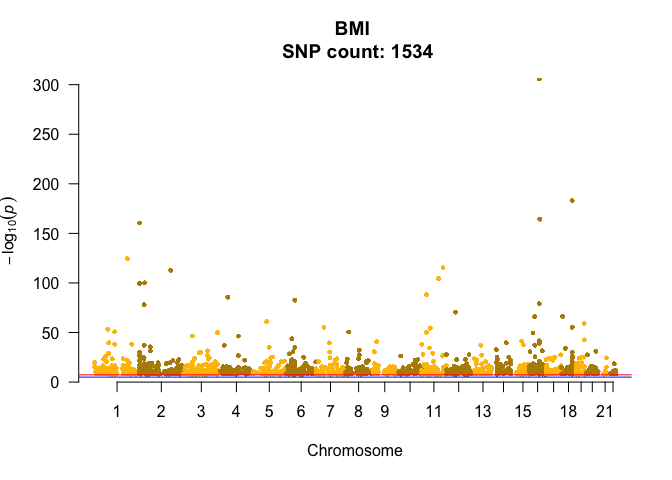<!-- -->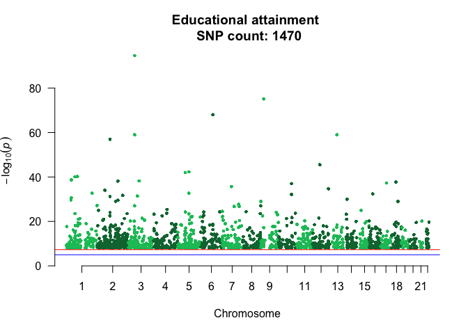<!-- -->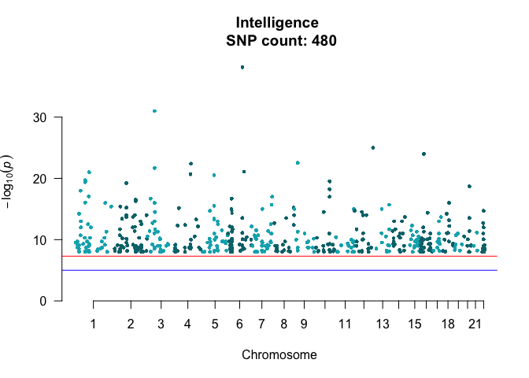<!-- --><!-- -->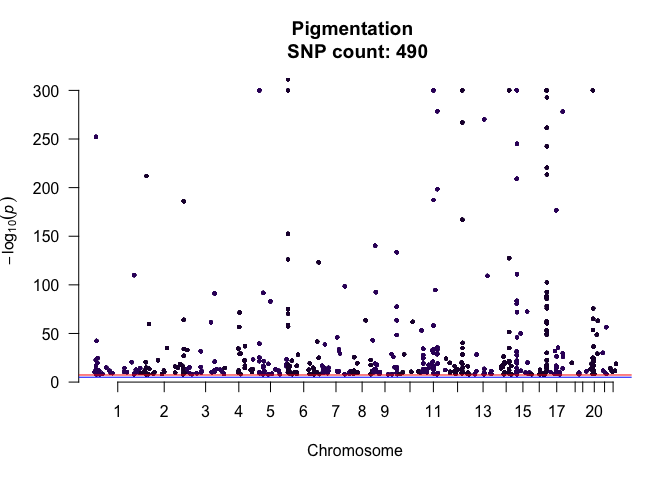<!-- -->


## Allele frequency distributions of risk alleles


```r
final_df %>%
  dplyr::filter(HIT_CONTROL == "hit") %>% 
  ggplot(aes(RISK_AF, fill = PHENO)) +
    geom_histogram(bins = 100) +
    scale_fill_manual(values = pal_primary) +
    facet_wrap(vars(PHENO), nrow = 2) +
    guides(fill = F) +
    xlab("Risk allele frequency") +
    ylab("Count") +
    theme_bw() +
    ggtitle("Frequency distribution of \"risk\" alleles (all 1KG populations combined)")
```

```
## Warning: Removed 28 rows containing non-finite values (stat_bin).
```

<!-- -->

```r
ggsave(here("plots", "20210127_af_distribution", "20210127_hits_all.png"),
       device = "png",
       units = "cm",
       dpi = 400,
       height = 12,
       width = 20)
```

## Allele frequency vs effect size


```r
one = final_df %>% 
  dplyr::filter(HIT_CONTROL == "hit" & POPN == "all") %>% 
  ggplot() +
    geom_point(aes(RISK_AF, OR_OR_BETA, colour = PHENO),
               alpha = 0.2) +
    scale_colour_manual(values = pal_primary) +
    facet_wrap(vars(PHENO), nrow = 2) +
    guides(colour = F, alpha = F) +
    theme_bw() +
    ggtitle("Risk allele frequency vs effect size (OR or beta)")

# Zoom in
two = final_df %>% 
  dplyr::filter(HIT_CONTROL == "hit" & POPN == "all") %>% 
  ggplot() +
    geom_point(aes(RISK_AF, OR_OR_BETA, colour = PHENO),
               alpha = 0.2) +
    scale_colour_manual(values = pal_primary) +
    facet_wrap(vars(PHENO), nrow = 2) +
    guides(colour = F, alpha = F) +
    theme_bw() +
    ggtitle("Risk allele frequency vs effect size (OR or beta)") +
    ylim(0,20)

one
```

```
## Warning: Removed 3463 rows containing missing values (geom_point).
```

```r
two
```

```
## Warning: Removed 3467 rows containing missing values (geom_point).
```

<div class="figure">
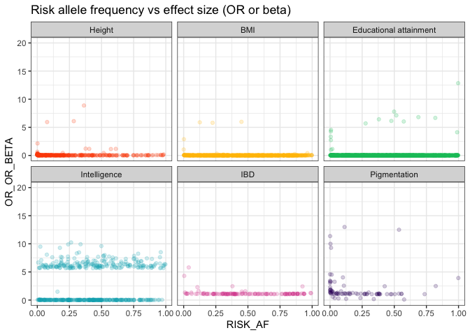
<p class="caption">Full size and zoomed to 0 < y < 20</p>
</div>


```r
ggsave(here("plots", "20210127_af_v_effect_size", "20210127_hits_all.png"),
       device = "png",
       units = "cm",
       dpi = 400,
       height = 12,
       width = 20)
```


```r
ggsave(here("plots", "20210127_af_v_effect_size", "20210127_hits_zoomed.png"),
       device = "png",
       units = "cm",
       dpi = 400,
       height = 12,
       width = 20)
```

## Fst

### With all populations

#### Get Fst stats for top SNPs


```r
# Create raw list of variants
case = here::here("data", "20210125_snp_hits_filtered")
control = here::here("data", "20210127_snp_rndm_filtered")
target_dirs = c(case, control)
names(target_dirs) = c("case", "control")

# Set seed
initial_seed = 53
set.seed(initial_seed)
seeds = sample(1:1000, size = length(target_dirs))

# Run 
counter = 0
fst_out = lapply(target_dirs, function(target_dir){
  # set counter 
  counter <<- counter + 1
  
  vcf_list_raw <- lapply(trait_levels, function(trait){
    target_file = file.path(target_dir, paste(trait, ".vcf.gz", sep = ""))
    # read in file
    vcf_out <- pegas::read.vcf(target_file)
    # filter `cases` for clumped SNPs, and take same number of `control` SNPs
    ## get target SNP IDs
    target_snps = data_list[[trait]]$clumped[[clump_param]]$SNP
    if (names(target_dirs)[counter] == "case"){
      ## filter VCF
      vcf_out = vcf_out[, colnames(vcf_out) %in% target_snps]
      ## take sample of same number of `control` SNPs
    } else if (names(target_dirs)[counter] == "control"){
      set.seed(seeds[counter])
      vcf_out = vcf_out[, sample(ncol(vcf_out), size = length(target_snps))]
    }
    
    return(vcf_out)
  })
  
  # Create vector of populations
  populations <- unlist(lapply(rownames(vcf_list_raw[[1]]), function(sample){
    meta$Population[meta$Sample == sample]
  }))
  
  # Generate Fst stats
  fst_out_df <- lapply(vcf_list_raw, function(pheno){
    out = as.data.frame(pegas::Fst(pheno, pop = populations))
    # put rownames into separate column
    out$snp <- rownames(out)
    
    return(out)
  }) %>% 
    # bind into single DF
    dplyr::bind_rows(.id = "phenotype") %>% 
    # remove NA
    tidyr::drop_na()
  
  return(fst_out_df)
}) %>% 
  dplyr::bind_rows(.id = "case_control")

# Recode phenotype
fst_out$phenotype <- factor(fst_out$phenotype, levels = trait_levels)
fst_out$phenotype = dplyr::recode(fst_out$phenotype, !!!recode_vec)
```

Write to file


```r
out_dir = here::here("data", "20210127_results")
out_path = file.path(out_dir, paste("20210127_fst", ".csv", sep = ""))

dir.create(out_dir)

readr::write_csv(fst_out, out_path)
```

Read back in 

```r
fst_out = readr::read_csv(here::here("data", "20210127_results/20210127_fst.csv"))
fst_out$phenotype <- factor(fst_out$phenotype, levels = trait_levels_verb)

knitr::kable(head(fst_out))
```


|case_control |phenotype | Fit|       Fst| Fis|snp        |
|:------------|:---------|---:|---------:|---:|:----------|
|case         |Height    |   1| 0.0543812|   1|rs2710889  |
|case         |Height    |   1| 0.2898026|   1|rs1240697  |
|case         |Height    |   1| 0.0972836|   1|rs28401288 |
|case         |Height    |   1| 0.0669376|   1|rs377599   |
|case         |Height    |   1| 0.0274605|   1|rs12028979 |
|case         |Height    |   1| 0.0888646|   1|rs5024246  |

#### *Fst* histograms


```r
one = fst_out %>%
  dplyr::filter(case_control == "case") %>% 
  ggplot() +
    geom_histogram(aes(Fst, fill = phenotype), bins = 100) +
    facet_wrap(~phenotype) +
    theme_bw() +
    scale_fill_manual(values = pal_primary)  +
    guides(fill = F)

two = fst_out %>%
  dplyr::filter(case_control == "control") %>% 
  ggplot() +
    geom_histogram(aes(Fst, fill = phenotype), bins = 100) +
    facet_wrap(~phenotype) +
    theme_bw() +
    scale_fill_manual(values = pal_secondary) +
    guides(fill = F)

one
two
```

<div class="figure">

<p class="caption">Cases vs controls</p>
</div>


```r
ggsave(here("plots", "20210127_histograms", "20210127_hits_all.png"),
       device = "png",
       units = "cm",
       dpi = 400,
       height = 12,
       width = 20)
```


```r
ggsave(here("plots", "20210127_histograms", "20210127_controls_all.png"),
       device = "png",
       units = "cm",
       dpi = 400,
       height = 12,
       width = 20)
```

#### *Fst* density

##### Facets


```r
one = fst_out %>% 
  dplyr::filter(case_control == "case") %>% 
  ggplot(aes(Fst, fill = phenotype)) +
    geom_density() +
    labs(fill = "Phenotype") +
    facet_wrap(~phenotype) +
    ylab("Density") +
    theme_bw() +
    scale_fill_manual(values = pal_primary) +
    guides(fill = F)


two = fst_out %>% 
  dplyr::filter(case_control == "control") %>% 
  ggplot(aes(Fst, fill = phenotype)) +
    geom_density() +
    labs(fill = "Phenotype") +
    facet_wrap(~phenotype) +
    ylab("Density") +
    theme_bw() +
    scale_fill_manual(values = pal_secondary) +
    guides(fill = F)

one
two
```

<div class="figure">

<p class="caption">Hits vs controls</p>
</div>


```r
ggsave(here("plots", "20210127_densities", "20210127_hits_all.png"),
       device = "png",
       units = "cm",
       dpi = 400,
       height = 12,
       width = 20)
```


```r
ggsave(here("plots", "20210127_densities", "20210127_controls_all.png"),
       device = "png",
       units = "cm",
       dpi = 400,
       height = 12,
       width = 20)
```

##### Ridges


```r
one = fst_out %>% 
  dplyr::filter(case_control == "case") %>% 
  ggplot() +
    geom_density_ridges2(mapping = aes(x = Fst, y = phenotype, fill = phenotype),
                         scale = 2) +
    scale_fill_manual(values = pal_primary) +
    ylab(label = NULL) +
    theme_bw() +
    guides(fill = F) +
    scale_y_discrete(expand = expand_scale(add = c(0.2, 2.3)))

two = fst_out %>%
  dplyr::filter(case_control == "control") %>% 
  ggplot() +
    geom_density_ridges2(mapping = aes(x = Fst, y = phenotype, fill = phenotype),
                         scale = 2) +
    scale_fill_manual(values = pal_secondary) +
    ylab(label = NULL) +
    theme_bw() +
    guides(fill = F) +
    scale_y_discrete(expand = expand_scale(add = c(0.2, 2.3)))

one
two
```

<div class="figure">
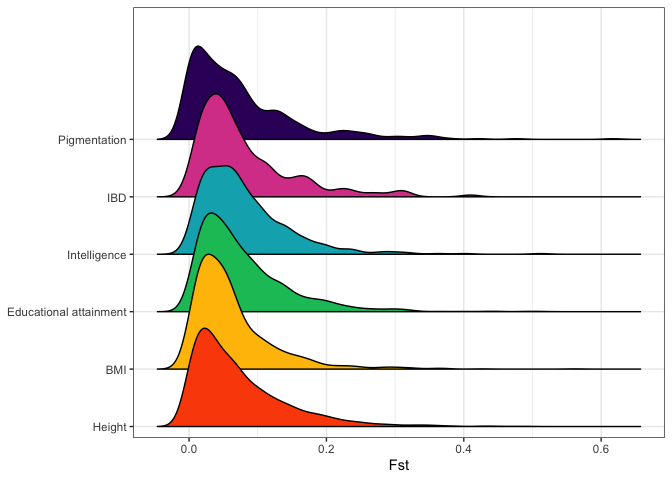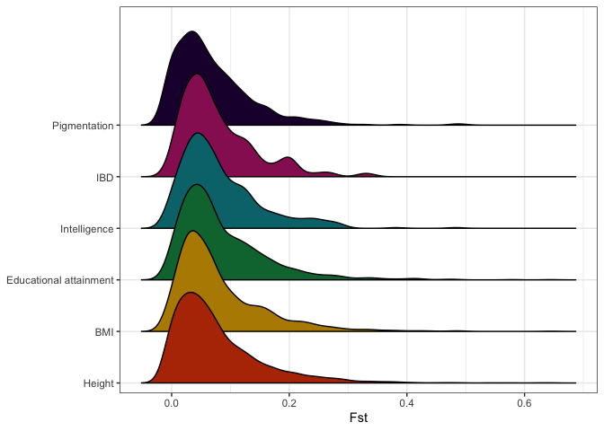
<p class="caption">Hits vs controls</p>
</div>


```r
ggsave(here("plots", "20210127_ridges", "20210127_hits_all.png"),
       device = "png",
       units = "cm",
       dpi = 400,
       height = 12,
       width = 20)
```


```r
ggsave(here("plots", "20210127_ridges", "20210127_controls_all.png"),
       device = "png",
       units = "cm",
       dpi = 400,
       height = 12,
       width = 20)
```

### Run Kolmogorov-Smirnov Tests


```r
case_control = unique(fst_out$case_control)
names(case_control) = case_control

ks_out = lapply(case_control, function(dataset){
  # filter dataset
  target_df = fst_out[fst_out$case_control == dataset, ]
  # run pairwise KS tests
  ks_out = lapply(trait_levels_verb, function(trait_a){
    out = lapply(trait_levels_verb, function(trait_b){
      results = ks.test(target_df$Fst[target_df$phenotype == trait_a],
                        target_df$Fst[target_df$phenotype == trait_b])
      P = results$p.value
      
      return(P)
    }) %>% 
      dplyr::bind_rows(.id = "test_b")
    
    return(out)
  })  %>% 
    dplyr::bind_rows(.id = "trait")
  
  traits = ks_out$trait
  ks_out$trait <- NULL
  
  rownames(ks_out) = traits
  return(ks_out)
})

# convert to matrix
ks_mat = lapply(ks_out, function(dataset){
  out = as.matrix(dataset)
  
  return(out)
})
```


```r
# Process for plotting
ks_out_gg = lapply(ks_out, function(dataset){
  out = dataset
  out$A = rownames(dataset)
  out = out %>% 
    pivot_longer(cols = -A, names_to = "B", values_to = "ks_P")
  # convert P-values to -log10
  out$ks_P = -log10(out$ks_P)
  
  return(out)
}) %>% 
  dplyr::bind_rows(.id = "case_control") %>% 
  dplyr::mutate(across(c("A", "B"),
                       ~factor(.x, levels = trait_levels_verb)))
```

Plot

```r
heat_hits_all = ks_out_gg %>% 
  dplyr::filter(case_control == "case") %>% 
  ggplot() +
    geom_tile(aes(A, B, fill = ks_P)) +
    scale_fill_viridis_c() +
    coord_fixed() +
    xlab(NULL) +
    ylab(NULL) +
    labs(fill = "KS-test\n-log(P)")

heat_controls_all = ks_out_gg %>% 
  dplyr::filter(case_control == "control") %>% 
  ggplot() +
    geom_tile(aes(A, B, fill = ks_P)) +
    scale_fill_viridis_c(option = "magma") +
    coord_fixed() +
    xlab(NULL) +
    ylab(NULL) +
    labs(fill = "KS-test\n-log(P)")

heat_hits_all
heat_controls_all
```

<div class="figure">
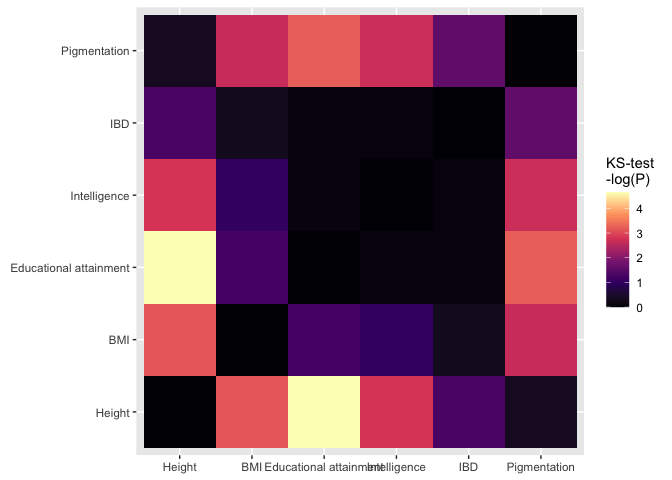
<p class="caption">Hits vs controls</p>
</div>


```r
ggsave(here("plots", "20210127_ks_heatmaps", "20210127_hits_all.png"),
       device = "png",
       units = "cm",
       dpi = 400,
       height = 12,
       width = 20)
```


```r
ggsave(here("plots", "20210127_ks_heatmaps", "20210127_controls_all.png"),
       device = "png",
       units = "cm",
       dpi = 400,
       height = 12,
       width = 20)
```

### Try with same number of SNPs 

[**Strategy**]{color="red"}: Will it make a difference if we analyse the same number of SNPs for each trait? i.e. is the different number of SNPs for each trait affecting the KS test output?

IBD only has 182 hits, so remove from this part of the analysis.

The trait with the next least number of hits is `Intelligence`, with `480. So we'll take a random sample of 40


```r
fst_sample = split(fst_out, f = fst_out$case_control)
fst_sample = lapply(fst_sample, function(dataset){
  out = split(dataset, f = dataset$phenotype)
  out = lapply(out, function(pheno){
    pheno = pheno %>% 
      dplyr::slice_sample(n = 480)
    
    return(pheno)
  }) %>% 
    dplyr::bind_rows() %>% 
    dplyr::filter(phenotype != "IBD")
}) %>% 
  dplyr::bind_rows()
```

#### Histograms


```r
one = fst_sample %>%
  dplyr::filter(case_control == "case") %>% 
  ggplot() +
    geom_histogram(aes(Fst, fill = phenotype), bins = 100) +
    facet_wrap(~phenotype) +
    theme_bw() +
    scale_fill_manual(values = pal_primary)  +
    guides(fill = F)

two = fst_sample %>%
  dplyr::filter(case_control == "control") %>% 
  ggplot() +
    geom_histogram(aes(Fst, fill = phenotype), bins = 100) +
    facet_wrap(~phenotype) +
    theme_bw() +
    scale_fill_manual(values = pal_secondary) +
    guides(fill = F)

one
two
```

<div class="figure">
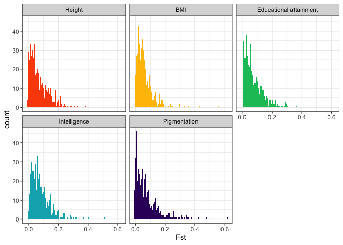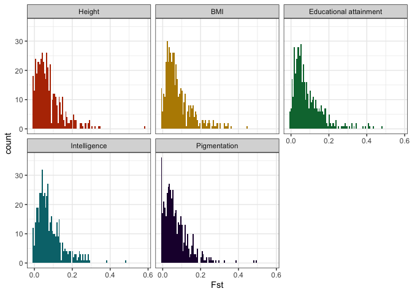
<p class="caption">SAMPLED: Hits vs controls</p>
</div>


```r
ggsave(here("plots", "20210127_histograms", "20210127_hits_sample.png"),
       device = "png",
       units = "cm",
       dpi = 400,
       height = 12,
       width = 20)
```


```r
ggsave(here("plots", "20210127_histograms", "20210127_controls_sample.png"),
       device = "png",
       units = "cm",
       dpi = 400,
       height = 12,
       width = 20)
```

#### Density


```r
one = fst_sample %>% 
  dplyr::filter(case_control == "case") %>% 
  ggplot(aes(Fst, fill = phenotype)) +
    geom_density() +
    labs(fill = "Phenotype") +
    facet_wrap(~phenotype) +
    ylab("Density") +
    theme_bw() +
    scale_fill_manual(values = pal_primary) +
    guides(fill = F)

two = fst_sample %>% 
  dplyr::filter(case_control == "control") %>% 
  ggplot(aes(Fst, fill = phenotype)) +
    geom_density() +
    labs(fill = "Phenotype") +
    facet_wrap(~phenotype) +
    ylab("Density") +
    theme_bw() +
    scale_fill_manual(values = pal_secondary) +
    guides(fill = F)

one
two
```

<div class="figure">
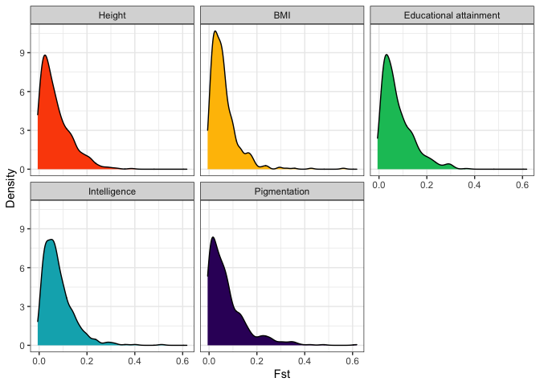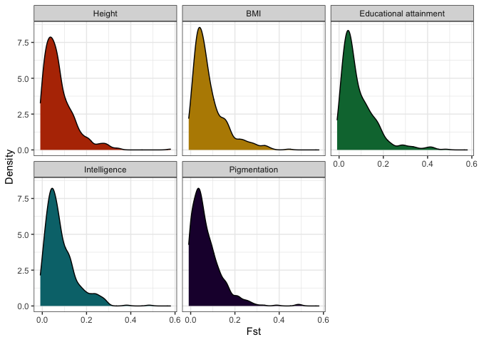
<p class="caption">SAMPLED: Hits vs controls</p>
</div>


```r
ggsave(here("plots", "20210127_densities", "20210127_hits_sample.png"),
       device = "png",
       units = "cm",
       dpi = 400,
       height = 12,
       width = 20)
```


```r
ggsave(here("plots", "20210127_densities", "20210127_controls_sample.png"),
       device = "png",
       units = "cm",
       dpi = 400,
       height = 12,
       width = 20)
```

### KS test


```r
case_control = unique(fst_sample$case_control)
names(case_control) = case_control

trait_levels_verb_sample = trait_levels_verb[-which(trait_levels_verb == "IBD")]
traits_sample = traits[-which(traits == "ibd")]

ks_sample = lapply(case_control, function(dataset){
  # filter dataset
  target_df = fst_sample[fst_sample$case_control == dataset, ]
  # run pairwise KS tests
  ks_out = lapply(trait_levels_verb_sample, function(trait_a){
    out = lapply(trait_levels_verb_sample, function(trait_b){
      results = ks.test(target_df$Fst[target_df$phenotype == trait_a],
                        target_df$Fst[target_df$phenotype == trait_b])
      P = results$p.value
      
      return(P)
    }) %>% 
      dplyr::bind_rows(.id = "test_b")
    
    return(out)
  })  %>% 
    dplyr::bind_rows(.id = "trait")
  
  traits = ks_out$trait_levels_verb_sample
  ks_out$trait <- NULL
  
  rownames(ks_out) = trait_levels_verb_sample
  return(ks_out)
})
```

#### Heatmaps


```r
ks_sample_gg = lapply(ks_sample, function(dataset){
  out = dataset
  out$A = rownames(dataset)
  out = out %>% 
    pivot_longer(cols = -A, names_to = "B", values_to = "ks_P")
  # convert P-values to -log10
  out$ks_P = -log10(out$ks_P)
  
  return(out)
}) %>% 
  dplyr::bind_rows(.id = "case_control") %>% 
  dplyr::mutate(across(c("A", "B"),
                       ~factor(.x, levels = trait_levels_verb_sample)))
```

Plot

```r
heat_hits_sample = ks_sample_gg %>% 
  dplyr::filter(case_control == "case") %>% 
  ggplot() +
    geom_tile(aes(A, B, fill = ks_P)) +
    scale_fill_viridis_c() +
    coord_fixed() +
    xlab(NULL) +
    ylab(NULL) +
    labs(fill = "KS-test\n-log(P)")

heat_controls_sample = ks_sample_gg %>% 
  dplyr::filter(case_control == "control") %>% 
  ggplot() +
    geom_tile(aes(A, B, fill = ks_P)) +
    scale_fill_viridis_c(option = "magma") +
    coord_fixed() +
    xlab(NULL) +
    ylab(NULL) +
    labs(fill = "KS-test\n-log(P)")
   
heat_hits_sample
heat_controls_sample
```

<div class="figure">
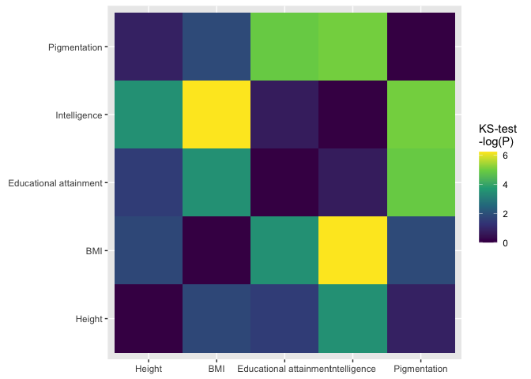
<p class="caption">SAMPLED: Hits vs controls</p>
</div>


```r
ggsave(here("plots", "20210127_ks_heatmaps", "20210127_hits_sample.png"),
       device = "png",
       units = "cm",
       dpi = 400,
       height = 12,
       width = 20)
```


```r
ggsave(here("plots", "20210127_ks_heatmaps", "20210127_controls_sample.png"),
       device = "png",
       units = "cm",
       dpi = 400,
       height = 12,
       width = 20)
```

### Compare effects of sampling on P-values


```r
heat_hits_all
heat_hits_sample
```

<div class="figure">

<p class="caption">Hits: all vs sample</p>
</div>


```r
heat_controls_all
heat_controls_sample
```

<div class="figure">
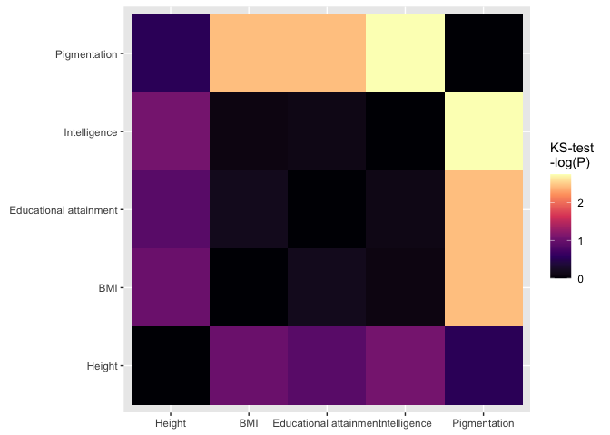
<p class="caption">Controls: all vs sample</p>
</div>
